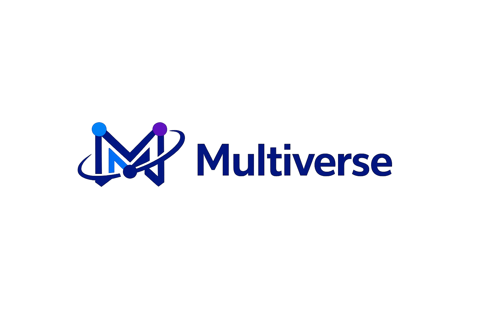
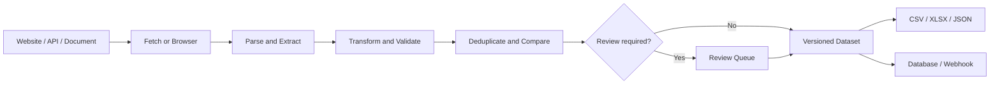
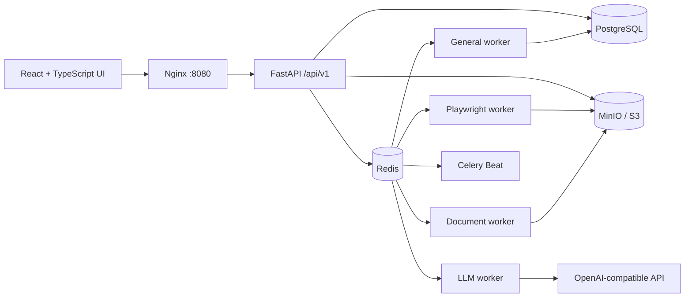

<!--
MAINTAINER / AGENT NOTES

Keep this README synchronized with the repository.

1. Verify every command from a clean checkout before changing Quick Start.
2. Derive supported nodes and integrations from the code, not from plans.
3. Do not publish credentials, real URLs containing tokens, customer data, or local artifacts.
4. Keep limitations explicit; move an item to Features only after it is implemented and tested.
5. Add CI and license badges only after the corresponding files exist.
6. Prefer one small, reproducible example over broad marketing claims.
7. Update the "Project status" section whenever the maturity or tenancy model changes.
-->

# Multiverse

<p align="center">
  
</p>

<p align="center">
  <strong>Build, run, review, and schedule data-extraction workflows from one self-hosted visual studio.</strong>
</p>

<p align="center">
  Multiverse turns websites, APIs, JavaScript pages, and documents into structured, versioned datasets—without stitching together a separate scraper, browser worker, transformation script, review tool, and export pipeline.
</p>

<p align="center">
  <a href="https://github.com/Vadimohka/Multiverse/actions/workflows/ci.yml"></a>
  <a href="https://www.python.org/downloads/release/python-3146/"></a>
  <a href="LICENSE"></a>
  <a href="https://github.com/Vadimohka/Multiverse/stargazers"></a>
  <a href="https://github.com/Vadimohka/Multiverse/issues"></a>
  <a href="https://github.com/Vadimohka/Multiverse/pulls"></a>
</p>

<p align="center">
  Created by <a href="https://vadimohka.com">Vladymtsev Vadim</a>
  (<a href="https://github.com/Vadimohka">Vadimohka on GitHub</a> ·
  <a href="https://www.linkedin.com/in/vadimohka/">LinkedIn</a>).
</p>

> **Project status:** early-stage, single-tenant MVP. Multiverse is ready for local evaluation and community development, but has not been qualified for large-scale or hostile public deployments.

## Why Multiverse?

A real collection workflow needs more than a parser: browser automation, retries, transformations, validation, raw evidence, scheduling, change detection, human review, exports, and operational visibility.



## Highlights

- Visual React Flow workflow builder with typed nodes, validation, publishing, test runs, and per-node inspection.
- HTTP requests, Playwright browser sessions, file downloads, pagination, link following, and concurrent page crawling with shared retry policy, cookie sessions, and signed resume tokens.
- CSS, XPath, repeating lists, HTML tables, JSONPath, and PDF/DOCX/XLSX/CSV/JSON parsing.
- Safe mapping, constants, formulas without Python `eval`, and financial value normalizers.
- DeepSeek and other OpenAI-compatible extraction and classification with JSON-schema validation and call history.
- Versioned datasets, review tasks, raw artifacts in MinIO/S3 or the local fallback, schedules, Celery workers, audit logs, health checks, and metrics.
- Stable SQL-backed dataset Data API for current state, latest/specific runs, history, exact-second source/fetch/observation filters, cursor pagination, predictable errors, and rate-limited scoped read-only tokens.
- Output to internal datasets, PostgreSQL/MySQL/SQLite, REST webhooks, CSV, XLSX, and JSON.

## Quick start

### Requirements

- Docker Engine
- Docker Compose v2
- GNU Make (recommended)

### Start the local stack

```bash
git clone https://github.com/Vadimohka/Multiverse.git
cd Multiverse
make up
```

`make up` creates `.env` from `.env.example` and replaces development passwords and encryption keys with generated values. Without Make, copy `.env.example` to `.env`, replace every placeholder secret, then run `docker compose up --build`.

Open the application at <http://localhost:8080>, API documentation at <http://localhost:8080/api/docs>, and health status at <http://localhost:8080/api/v1/health>.

The local administrator email and generated password are in `.env`:

```bash
grep '^DEFAULT_ADMIN_' .env
```

Never commit `.env` or reuse its development credentials in a public deployment.

For low-resource servers (1 vCPU, 1 GiB RAM), see [the minimal Compose deployment guide](README.MIN.md).

## First workflow

On first startup, Multiverse seeds a deterministic bank-deposit demo. It fetches local financial HTML, extracts deposit cards, normalizes values, validates and versions three records, creates review tasks, approves the records, and exports the dataset to XLSX. Use it to verify the installation before connecting external websites.

It also installs seven source-agnostic public-data templates: HTML cards,
list-to-detail pages, HTML tables, RSS/XML feeds, JSON API/XHR, browser-rendered
lists and public documents. Create a Source first, then choose a template and
configure its selectors, JSONPath, pagination and mapping in the UI. Templates
do not embed a site URL, selector, source ID or dataset ID.

The supported boundary is the representation normally delivered to an anonymous
visitor: public HTML, feed, API/XHR, browser render and downloadable documents.
Multiverse does not bypass login, CAPTCHA, paywalls, robots restrictions or other
access controls. See the [universal scraper blueprint](docs/audit/UNIVERSAL_SCRAPER_BLUEPRINT_2026-08-12.md)
for the source matrix and the [Data API contract](docs/audit/DATA_API_CONTRACT.md)
for read-only token and `from`/`to` query examples.

## Node catalog

The current engine exposes **26 executable node types**.

| Category | Nodes |
| --- | --- |
| Trigger (1) | Manual Trigger |
| Fetch (6) | HTTP Request, Browser Open, Download File, Follow Links, Pagination, Crawl Links |
| Parse (6) | Parse HTML, Select Elements, Repeating List, Parse Table, JSONPath, Parse Document |
| Transform (4) | Transform, Mapping, Set Constant, Formula |
| AI (2) | LLM Extract, LLM Classify |
| Validate (1) | Validate |
| Merge (1) | Deduplicate |
| Logic (1) | Condition |
| Output (4) | Save Dataset, Save External DB, Export File, Send Webhook |

The public node contract defines input and output data types so the API and browser editor validate the same graph structure.

## Architecture



| Layer | Technology |
| --- | --- |
| Frontend | React, TypeScript, Vite, React Flow, TanStack Query |
| API | FastAPI, Pydantic, SQLAlchemy, Alembic |
| Workflow execution | Python DAG engine and Celery |
| Browser automation | Playwright + Chromium |
| Document processing | Docling when available, Tesseract, pypdf, python-docx, openpyxl |
| Data services | PostgreSQL, Redis, MinIO/S3 |
| AI providers | DeepSeek and other OpenAI-compatible APIs |
| Deployment | Docker Compose and Nginx |

## Browser, documents, and AI

`Browser Open` supports click, fill, select, hover, key press, wait, scroll, and JavaScript actions. Runs can retain rendered HTML, screenshots, captured JSON/XHR responses, browser profiles, and encrypted storage state. Selector snapshots expose a screenshot, DOM bounding boxes, and CSS/XPath candidates.

The document worker handles PDF (Docling where available with `pypdf` fallback), DOCX, XLSX, CSV, and JSON. Downloads and derived artifacts are stored with run metadata and a SHA-256 digest.

Configure an OpenAI-compatible provider in the application or environment:

```dotenv
DEEPSEEK_BASE_URL=https://api.deepseek.com
DEEPSEEK_API_KEY=
DEEPSEEK_DEFAULT_MODEL=deepseek-chat
```

Provider keys are encrypted at rest and never returned by the API. Prefer CSS, XPath, JSONPath, and deterministic transformations; use LLM nodes for ambiguous content or a controlled fallback.

## Scheduling, history, and review

Published workflows can have five-field cron schedules with an explicit time zone. Celery Beat routes work to `default`, `browser`, `documents`, `llm`, `exports`, and `maintenance` queues.

Records are compared through natural keys and stable content hashes. Depending on policy, a new version becomes current automatically or enters the Review Queue, where it can be approved, corrected, or rejected without replacing the current record.

## Local development

Backend development requires CPython 3.14.6 using the standard GIL-enabled build. The official Docker images and CI are verified on Linux amd64, and the migration was additionally tested on Linux arm64 using Apple Silicon.

```bash
python3.14 -m venv .venv
source .venv/bin/activate
pip install -r requirements-dev.txt

export PYTHONPATH="$PWD/apps/api:$PWD/packages"
export DATABASE_URL=sqlite:///./parser_studio.db
export INTERNAL_API_URL=http://127.0.0.1:8000

alembic upgrade head
uvicorn app.main:app --app-dir apps/api --reload --port 8000
```

For the frontend:

```bash
cd apps/frontend
npm install
npm run dev
```

For a development Compose override:

```bash
docker compose -f docker-compose.yml -f docker-compose.dev.yml up --build
```

## Verification

```bash
make test
make lint
cd apps/frontend && npm test -- --run && cd ../..
make frontend-lint
make frontend-build
npm --prefix apps/frontend audit --audit-level=high
python scripts/load_test_data_api.py
docker compose config --quiet
```

The smoke test can be run separately with `python scripts/smoke_test.py`; it starts the API on an available local port and exercises the seeded input workflow from authentication through normalization, review, export, and metrics. HTTP/browser egress safety is verified separately by the egress regression suite, so the smoke test never weakens the private-network block for a local fixture.

## Project status and limitations

Multiverse currently targets a single trusted organization or local installation. Known limitations:

- no multi-tenant isolation;
- no interactive VNC/noVNC session for manually logging into websites;
- selector assistance is not a replacement for browser DevTools;
- no dedicated GraphQL builder or email trigger/output;
- no visual join, group aggregation, fuzzy matching, or SCD2 writer;
- cancellation may not immediately terminate an active browser or document process;
- million-record operation still needs dedicated load testing, partitioning, and streaming-export work;
- some internal identifiers retain the original `parser-studio` / `parser_studio` name during the public rebrand.

Read the [implementation report](IMPLEMENTATION_REPORT.md), [acceptance checklist](docs/acceptance-checklist.md), [architecture](docs/architecture.md), and [user guide](docs/USER_GUIDE.md) for more detail.

## Security and responsible use

Before exposing Multiverse to the internet, replace all secrets and default credentials; terminate TLS at a hardened reverse proxy; restrict PostgreSQL, Redis, and MinIO; configure backups; review CORS/proxy settings; and use least-privilege external credentials.

Report vulnerabilities privately as described in [SECURITY.md](SECURITY.md), never in a public issue. Use Multiverse only for data you are authorized to access, respecting applicable laws, privacy requirements, robots and rate-limit policies, site terms, content licences, and third-party service limits.

## Contributing

Contributions are welcome—especially deterministic parser nodes, document formats, selector UX, parser fixtures, internationalization, tests, security hardening, and adapters. Read [CONTRIBUTING.md](CONTRIBUTING.md) and follow the [Code of Conduct](CODE_OF_CONDUCT.md) before opening a pull request.

## License

Multiverse is released under the [MIT License](LICENSE).

Copyright © 2026 [Vladymtsev Vadim](https://vadimohka.com).
