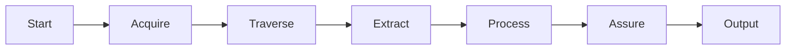
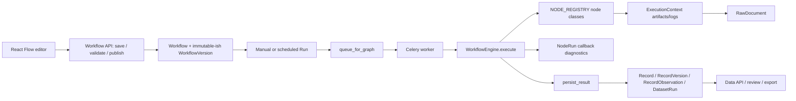

# Production-аудит и blueprint универсального node-based scraper engine

Дата проверки: **12 августа 2026 г.**  
Объект: репозиторий `Multiverse`, локальный стенд и полный список seed URL/source roles из задания.  
Целевой принцип: **ноды реализуют универсальные механизмы; шаблоны содержат только декларативную конфигурацию источника**.

## Зафиксированные решения владельца продукта

Следующие решения являются входными ограничениями плана, а не гипотезами автора аудита:

1. Пользователь собирает workflow из малого набора универсальных настраиваемых нод. Новый сайт, CMS, формат контента или способ пагинации не должен порождать новую ноду.
2. В первую очередь прокачиваются существующие ноды. Целевые роли `Start`, `Acquire`, `Traverse`, `Extract`, `Process`, `Assure`, `Output` реализуются поверх текущих type keys `manual_trigger`, `http_request`, `crawl_links`, `mapping`, `transform`, `validate`, `output`. Обязательного добавления семи новых типов в каталог нет.
3. URL из задания — seed/точка входа, а не обязательный URL фактического извлечения. Redirect сам по себе не является ошибкой: данные можно брать с безопасного конечного URL, найденной canonical/detail-страницы, публичного API/XHR/feed или документа, если результат удовлетворяет целевой schema и completeness assertions.
4. Каждый переход и фактический источник поля сохраняются в provenance. Redirectы, alternative endpoints и browser fallback не должны быть скрыты от debugger, но не должны мешать успешному извлечению.
5. Необратимые решения — переименование/скрытие legacy-нод, границы универсальных ролей и default fallback policy — проходят короткий product/architecture review до изменения публичного каталога.

## Политика доказательств и границы аудита

В отчёте используются три явные метки:

- **Проверено** — подтверждено чтением текущего кода, запуском локального стенда, тестом или просмотром реальной страницы/переходом по ней 12.08.2026.
- **Ограничение проверки** — попытка выполнена, но доступ, рендеринг, авторизация, anti-bot, нестабильность страницы или среда не позволили доказать полный цикл.
- **Требуется дополнительная верификация** — вывод нельзя безопасно распространить на весь архив, все варианты продукта или все состояния UI по одной проверенной выборке.

HTTP 200, непустой `<body>` и сам факт появления карточек **не считаются** доказательством полноты. Для положительного результата проверялись, насколько это было возможно: listing, переход в detail, источник данных, пагинация, документы, динамические элементы и наличие требуемых полей. Аудит не обходил login, CAPTCHA, paywall и иные ограничения доступа.

Ключевые файлы доказательной базы: `packages/workflow_engine/catalog.py`, `packages/workflow_engine/nodes.py`, `packages/workflow_engine/engine.py`, `apps/api/app/services/source_profiler.py`, `apps/api/app/seed_templates.py`, `apps/api/app/routers/workflow_templates.py`, `apps/frontend/src/workflow-editor.tsx`, `apps/frontend/src/pages.tsx`, `docs/audit/FORENSIC_AUDIT.md`, `docs/audit/TARGET_ARCHITECTURE.md`, `docs/audit/REPAIR_PLAN.md`, а также отдельные backend/frontend-аудиты от 12.08.2026.

# 1. Executive Summary

Multiverse уже является работающим вертикальным прототипом: FastAPI/SQLAlchemy, Celery/Redis, PostgreSQL, MinIO, React/Vite/React Flow и Playwright связаны в единый продукт. Локальный compose-стенд поднялся, API healthy, UI позволил войти, открыть dashboard, templates, workflow editor, настроить ноду, опубликовать и запустить workflow, посмотреть runs и datasets. Frontend unit-тесты (5 тестов в 3 файлах) и production build прошли.

Однако движок пока нельзя считать универсальным production scraper engine. Формально каталог содержит 26 нод, но пользователь должен знать слишком много технических различий: HTML или JSON, table или document, HTTP или browser, listing или detail fan-out. Одновременно фактическая оркестрация сложных сайтов спрятана в `crawl_links`. Получились две крайности — много мелких технических нод и одна перегруженная «сделать всё» нода — вместо малого набора понятных универсальных операций.

Главный вывод аудита:

> Не нужен отдельный parser class или отдельная UI-нода для каждого вида страницы и контента. Нужен небольшой стабильный набор крупных универсальных нод. Каждая нода сама умеет выбирать и пробовать несколько внутренних стратегий, а пользователь задаёт цель, приоритеты, ограничения, selectors/paths и fallback-порядок через UI. Отличия сайтов живут в параметрах template revision, а не в новых типах нод.

Наиболее важные изменения:

1. Свести целевой каталог к семи пользовательским ролям: `Start`, `Acquire`, `Traverse`, `Extract`, `Process`, `Assure`, `Output`, реализовав их как contract v2 существующих нод. Новый формат содержимого или пагинации добавляет стратегию/параметр, а не новый type key.
2. Внутри каждой ноды реализовать strategy registry, который не показывается на canvas россыпью технических нод. Например, `Extract` умеет JSON, JSON-LD, DOM, repeating containers, tables, PDF/DOC/XLSX и OCR; `Acquire` — API, HTTP, browser и files; `Traverse` — page/offset/cursor/next/button/load-more/scroll/tabs/filters/detail.
3. Дать универсальным нодам режимы `AUTO`, `ASSISTED`, `MANUAL`. `AUTO` ранжирует разрешённые strategies и принимает результат только после postconditions; `ASSISTED` предлагает найденные варианты пользователю; `MANUAL` фиксирует выбор. Production template хранит fallback chain и constraints, а run — фактически сработавшую стратегию и evidence.
4. Ввести единые `SourceBundle`, `RecordSet` и `RunAssessment` с raw artifacts, timestamps, lineage и typed errors вместо неформальных словарей.
5. Версионировать graph, параметры универсальных нод, automatic-strategy revision, source policy, dataset schema и secret/browser bindings; запуск ссылается на неизменяемый executable snapshot.
6. Перестроить UI вокруг настройки цели каждой ноды и preview её попыток/fallbacks, оставив raw JSON только в advanced mode.
7. До расширения возможностей закрыть production blockers: IDOR/изоляцию проектов, SSRF, утечку секретов через node-test, ресурсные лимиты, реальную отмену jobs, immutable workflow versions и scheduler lock.

Самые сложные классы источников — не просто JS-сайты. Это комбинации: банковские продукты с формулами/таблицами/документами и UI-фильтрами; платные материалы; API + shell; nested tabs; JS paginator; документы как источник истины; а также источники, где заданный URL фактически ведёт не в тот клиентский сегмент. Такой URL не бракуется из-за redirect/relocation: `Acquire` и bounded `Traverse` пытаются найти пригодное публичное представление в разрешённой области. Browser automation требуется лишь там, где данные нельзя получить стабильным публичным HTTP/API путём; использовать браузер по умолчанию дороже и менее воспроизводимо.

# 2. Current Architecture

## 2.1. Фактическая топология

```text
React/Vite UI (8080)
  -> FastAPI REST / OpenAPI
       -> PostgreSQL: projects, sources, workflows, versions, runs,
          node_runs, datasets, records, versions, observations
       -> MinIO/local artifacts: HTML, JSON, screenshot, documents
       -> Redis/Celery queues
            -> general worker
            -> browser worker (Playwright)
            -> document worker
            -> LLM worker
       -> Celery beat schedules

WorkflowEngine
  -> validates a DAG and simple port types
  -> executes nodes in topological order
  -> merges predecessor dictionaries
  -> invokes per-node callback for node-run diagnostics
```

**Проверено:** compose запустил API, frontend, PostgreSQL, Redis, MinIO, beat и четыре worker-role; API имел healthy status. На момент проверки БД содержала 3 projects, 3 sources, 3 datasets, 7 workflows и 4 runs (`SUCCESS=2`, `FAILED=1`, `RUNNING=1`). `RUNNING` был начат 11.08.2026 07:42 UTC и оставался незавершённым 12.08 — это фактическое свидетельство отсутствия stale-run reconciliation. В API выдаются пять system templates из кода; таблица `workflow_templates` при проверке была пустой, то есть «5 templates в UI» не означает пять persisted rows.

## 2.2. Исполнение workflow

`WorkflowEngine.execute()` валидирует DAG, строит входящие/исходящие рёбра, последовательно исполняет готовые ноды и поддерживает branching через `condition`. Контракт ноды — один основной `input_type`, `output_type` и `output_item_path`. Это полезная основа, но типы слишком крупные (`OBJECT`, `DOCUMENT`, `ARRAY_OBJECT`, `BINARY`), а merge нескольких входов — не самостоятельный проверяемый join contract.

Текущий `context.cancelled` проверяется между нодами и внутри части crawl loop, но HTTP/browser/document/LLM операции не получают надёжного распределённого cancellation token. Backend-аудит подтвердил, что API cancel может быть позже перезаписан worker'ом в success.

Повтор запросов частично унифицирован в transport policy (`Retry-After`, statuses, backoff), но orchestration retry, node retry, Celery retry и partial retry не образуют одной state machine. `resume_token` существует только внутри большой crawler-ноды и не является engine-level checkpoint.

## 2.3. Fetch/browser/extraction

- `http_request` умеет методы, headers/query/body/cookies, timeout, retry и raw artifact; по профилю источника может неявно переключиться в browser.
- `browser_open` создаёт новый Chromium/context на каждый вызов, применяет actions, перехватывает JSON/XHR, сохраняет HTML/screenshot/network и при ошибке по умолчанию молча откатывается к HTTP.
- Browser helper внутри той же ноды самостоятельно обходит semantic tabs и next controls, склеивая несколько документов в искусственный HTML.
- `source_profiler.py` (431 строка) делает HTTP-профилирование, при необходимости Playwright enrichment, XHR capture, эвристику повторяющихся контейнеров, candidates для selectors/pagination/metadata/tables. Это хорошая discovery-функция, но её вывод не является проверенным исполнимым template и не доказывает полноту.
- HTML, repeating list, table, JSON path и документы уже имеют отдельные parsers, но сложный crawler часто обходит их внутренними helper-вызовами.

Неявный AUTO/fallback удобен для демо, но плох для воспроизводимости: run должен фиксировать фактически применённый transport, browser build/profile, status, headers, content hash и причину fallback. Нельзя считать HTTP fallback успешным, если browser path упал и вернул пустой shell.

## 2.4. Persistence и provenance

Модель `Record -> RecordVersion -> RecordObservation` и `RawDocument` уже движется в правильном направлении. Data API различает current/latest_run/run/history и `source_published_at`, `source_modified_at`, `fetched_at`, `observed_at`. Но end-to-end lineage зависит от того, передала ли нода ожидаемые reserved fields; существующие audits отмечают возможность привязки постороннего raw artifact к observation внутри run и неполный аудит sensitive actions.

## 2.5. UI

**Проверено в реальном UI:** dashboard, templates, BCSE workflow, canvas, `crawl_links` inspector, selector picker, node test, save/publish/run, datasets и run diagnostics доступны. Каталог отображает все 26 нод.

Критические gaps для scraper-authoring:

- конфигурация `crawl_links` представляет десятки разнородных полей одним длинным inspector;
- нет guided preview цепочки listing/page 2/detail/extracted record/completeness;
- `DetailFieldsEditor` показывает только selector, metadata/JSON-LD и listing source, хотя backend поддерживает `response`/detail JSON paths;
- JSON action editor не даёт надёжно сконструировать click/select/wait/scroll state machine;
- undo/redo хранит только массив nodes, но не edges, settings и layout transaction;
- raw HTML/DOM доступен через artifacts/diagnostics фрагментарно, а не как сопоставленный source-vs-rendered inspector;
- нет diff template revisions, dry-run с budget, contract-aware edge adapters и per-item failure browser.

# 3. Current Nodes

Все 26 типов из `NODE_CATALOG` существуют в registry. Таблица описывает фактический, а не заявленный контракт.

| Node | Назначение / вход → выход | Что умеет и настраивается | Ограничения / hardcoded поведение | Что изменить |
|---|---|---|---|---|
| `manual_trigger` | run input → object | Передаёт initial input/context variables | Только control seed; нет typed parameter schema | Мигрировать в параметры `Start`: input JSON Schema и immutable run parameters |
| `http_request` | object → document | URL template, method, headers, query/body, cookies, timeout/retry, raw artifact | Неявно вызывает browser по source profile; SSRF policy не является обязательным node contract | Сделать HTTP/API одной из стратегий `Acquire`; transport plan, postcondition и fallback явно настраиваются и протоколируются |
| `browser_open` | object → document | Chromium, profile/proxy/cookies/storage, actions, tabs, pagination, XHR, screenshot | Смешивает render/interact/traverse/capture; новый browser на вызов; HTTP fallback может скрыть дефект | Разнести ответственность между `Acquire` (render/XHR) и `Traverse` (actions/states); browser pool и fallback остаются внутренними services/strategies, не canvas nodes |
| `download_file` | object → binary | HTTP/file artifact, content type, filename, retry | Не управляет лимитами decompression/pages; URL risk | Сделать file/download-стратегией `Acquire`; добавить size/MIME/hash/allowlist/quarantine |
| `follow_links` | array → array | Fan-out HTTP details, selector fields/table, merge modes, concurrency, URL policy | Повторяет часть `crawl_links`; HTML transport only; orchestration и extraction связаны | Мигрировать link/detail scope в `Traverse`, получение detail artifacts — в `Acquire`, чтение полей — в `Extract`; fan-out/join остаются внутренней оркестрацией |
| `pagination` | object → pages | Генерирует page/offset URL template | Только page/offset; не читает next/cursor/JS/stop from response | Мигрировать в параметры `Traverse` с registry стратегий и checkpoint state |
| `crawl_links` | object → records | Listing HTTP/browser/API, pagination, tabs, discovery, detail HTTP/browser/API, recursion, extraction, retry, resume, artifacts, completeness | God node; 50+ settings; внутренние вызовы других нод; сложные failures сводятся в один node run | Compatibility adapter раскладывает legacy config по `Acquire`, `Traverse`, `Extract`, `Process`, `Assure`; новых публичных нод из его внутренних шагов не создавать |
| `parse_html` | document → object | Text, links, raw HTML, tables, title/language | Не формирует DOM snapshot id; потеря связи каждого fragment с fetch | Использовать как внутренний HTML-adapter `Extract`; возвращать source spans/DOM path |
| `select_elements` | object → array | CSS/XPath, attribute/text/html, single | Контракт `single` не согласован с array output; нет per-field fallback chain | Объединить с остальными способами чтения в `Extract`; field schema задаёт DOM candidate, fallbacks и evidence |
| `extract_repeating_list` | object → array | Container selector и relative fields | Требует ручного CSS; нет cardinality/unique-link assertions | Сделать collection-режимом `Extract`; добавить auto-candidates, ручные paths и assertions |
| `parse_table` | object → array | Header row/table selector, структурные ключи | Complex headers/rowspan/footnotes/unit semantics ограничены | Сделать table-adapter `Extract` с header graph, units, row lineage и fallback к другим представлениям |
| `json_path` | document → array | JSON path/array discovery | DOCUMENT может быть text/JSON; неоднозначный coercion; нет pagination token output | Сделать JSON-adapter `Extract`: strict parse, schema, JSON Pointer evidence; traversal tokens передавать `Traverse` через служебные hints |
| `parse_document` | binary → array | CSV/XLSX/DOCX/PDF, Docling, OCR options | Один output тип для text/tables; resource exhaustion; старые `.doc` не покрыты надёжно | Сделать document-adapter `Extract`: typed sections/tables, OCR fallback, sandbox, budgets и parser/version metadata |
| `transform` | array → array | Rename/trim/number/date/currency/term/rate operations | Набор операций не является версионированной DSL; часть financial semantics в core normalizers | Мигрировать в конфигурацию `Process`: generic primitives в registry, domain dictionaries/formulas — в preset |
| `mapping` | array → array | Явное target←source mapping и marker сформированных business records | Не читает heterogeneous artifacts, не выражает collection/field candidates, union/fallback/evidence propagation полностью | Сохранить legacy mapping behavior и эволюционировать type key в facade `Extract`: schema-first collection/field candidates используют внутренние HTML/JSON/table/document adapters; простое target←source mapping остаётся compatibility mode |
| `set_constant` | object → array | Создаёт объекты/массивы | Неочевидный array contract для scalar object | Константы источника хранить в `Start`/preset, создание полей — в `Process`; строгая output schema |
| `formula` | array → array | Safe date/time helpers и простые expressions | Ограниченная DSL; нет dependency/type validation до run | Сделать formula-операцией `Process`; компилировать и типизировать при publish, разрешить только pure deterministic functions |
| `llm_extract` | object → array | Provider/model/prompt/schema/json mode | Нельзя делать LLM источником факта; cost/PII/prompt-injection; fallback_to_input опасен | Разрешить в `Extract` только как явно включённый последний candidate над сохранённым evidence либо в `Process` как enrichment; budgets/confidence/review обязательны |
| `llm_classify` | text → object | Enum classification через LLM Extract | Неудобен для коллекции; мало evidence/threshold semantics | Сделать semantic-операцией `Process`: batch, taxonomy, threshold, prompt/model/result/evidence и review route |
| `validate` | array → array | required/ranges/JSON Schema, fail-on-error | Нет quarantine port и cross-record/completeness rules | Record/schema validation перенести в `Assure`; valid/invalid/quarantine и run-level assertions настраиваются отдельно внутри одной ноды |
| `deduplicate` | array → array | Дедупликация по keys | Только в памяти одного потока; нет canonicalization, cross-run merge policy | Сделать identity/dedup/merge-операциями `Process`; persistence-aware policy исполняется совместно с `Output` по явному контракту |
| `condition` | object → object | eq/ne/range/contains/exists/empty, true/false ports | Простая scalar логика; не коллекционный Filter | Мигрировать business filtering/routing в `Process`; control predicate оставить внутренней операцией execution plan, не отдельной пользовательской нодой |
| `output` | array → array | Dataset, natural keys, on_empty, minimum, review policy | Persist/completeness/review смешаны; частичная запись может предшествовать failure | Проверки minimum/empty/review перенести в `Assure`, запись — в транзакционный `Output` после успешного assessment |
| `save_external_db` | array → array | insert/upsert в allowlisted table | Высокий риск внешней мутации; mapping/DDL/rollback ограничены | Сделать external-DB adapter внутри `Output` с credential scope, dry-run, transaction/idempotency contract |
| `export_file` | array → binary | JSON/CSV/XLSX artifact | Нет streaming/size constraints/schema workbook contract | Сделать export adapter внутри `Output`; streaming и size/schema limits, не основное хранилище |
| `send_webhook` | array → object | URL/headers/timeout payload | Нет delivery outbox/idempotency/signature/retry contract; SSRF | Сделать webhook adapter внутри `Output`: outbox, signature, allowlist, idempotency и replay controls |

Вывод: 26 legacy-типов не нужно переносить в новый каталог один к одному. Их generic реализацию следует переиспользовать как внутренние strategies/adapters семи фасадов; пользователь на canvas выбирает только `Start → Acquire → Traverse → Extract → Process → Assure → Output`. Простое добавление flags в `crawl_links` или новых нод под HTML/JSON/table/document повторит текущую проблему.

# 4. Current Templates

Система различает:

1. **System templates в коде** — BCSE site preset и четыре starter blueprint (`list→detail`, web page, JSON API, document). Они собираются API динамически.
2. **User templates в БД** — очищенные snapshots graph. `_clean_graph()` удаляет source/dataset binding, literal URLs и часть site-specific crawler fields.
3. **Workflow graph** — фактически инстанцированный и настроенный под источник executable snapshot.

Это разумное начало, но терминология смешивает два разных продукта:

- **Blueprint** — source-independent topology из семи стабильных фаз (`Start → Acquire → Traverse → Extract → Process → Assure → Output`); ненужная конкретному источнику фаза может работать как явный pass-through, но типы нод не меняются.
- **Source preset/template revision** — именно конфигурация конкретного сайта: URLs, selectors, JSON paths, actions, schemas, policy и expected coverage.

Текущий cleanup не решает разделение ответственности: если удалить URL/selectors/detail fields из рабочего workflow, сохраняется пустой starter, а не переносимая конфигурация проверенного источника. И наоборот, system BCSE preset корректно держит site logic вне generic engine, но содержит literal listing URL, BCSE selectors, `/solo/calendar`, regex/id schema и константы. Это **допустимая source configuration**, не universal template; её следует явно назвать `SourcePresetRevision` и версионировать как данные.

Граница configuration/implementation должна быть такой:

| В implementation ноды | В template/source preset |
|---|---|
| Внутренние `Acquire` strategies: HTTP/API/browser/XHR/file, redirects, retry, browser lifecycle | Разрешённые strategies и их приоритет; URL/method/query/headers secret refs; fallback postconditions |
| Внутренние `Traverse` strategies: page/offset/cursor/button/scroll/tabs/details/recursion | Scope, selectors, start/stop/max, expected states и strategy mode |
| Внутренние `Extract` adapters: CSS/XPath/JSONPath/JSON-LD/table/document/OCR | Target schema, container/field candidates, fallbacks, value conversions |
| Внутренние fan-out, bounded concurrency и join mechanics | Detail/file scopes, URL field, allowed domains, merge keys |
| Pure normalization DSL runtime | Mappings, dictionaries, units, locale, rate formula policy |
| JSON Schema validator, error/quarantine mechanics | Dataset schema, required fields, thresholds |
| Artifact/provenance/checkpoint persistence | Retention, completeness expectations, review policy |
| LLM client and schema-constrained output | Taxonomy, prompt revision, threshold, budget |

Недопустимо переносить `if host == ...`, конкретный selector, BCSE marker, bank-name dedupe или business field rename в `nodes.py`. Допустимо, что source preset описывает именно конкретный сайт — это и есть его назначение.

# 5. Source-by-Source Audit

## 5.1. Новости, публикации и рыночные данные

| Source | Listing | Pagination | Cards | Detail | Dynamic | API | Files | Current status | Required changes |
|---|---|---|---|---|---|---|---|---|---|
| `https://www.bcse.by/press-center/releases` | HTML shell; фактический список приходит из `/press_center/calendar` | JS pagination в UI; API возвращает `tabs[].contents[]` | URL/id/date/title в JSON | `/solo/calendar?link=…&sDay=…` возвращает detail | Да | **Проверено** `/press_center/calendar`, `/solo/calendar` | В detail возможны attachments | Preset работает через большую crawler-ноду; нулевая статическая страница не означает пустой источник | `Acquire`: API-first; `Traverse`: tabs/pages/detail IDs; `Extract`: JSON→DOM/docs; `Assure`: tabs/pages/IDs completeness |
| BCSE news category (`/press-center`, discovery с главной) | Tabs «Новости биржи/эмитентов» | Та же calendar-модель требует отдельного category mapping | Карточки ведут в full content | Detail endpoint того же семейства | Да | Calendar/solo pattern | Возможны документы | Экономическая релевантность не равна URL category | `Traverse`: category/tabs/details; `Extract`: JSON/DOM/docs; `Process`: deterministic rules → semantic review; `Assure`: decision evidence |
| `https://www.bcse.by` | Рендерит widgets/tabs | Не применимо | Currency/REPO widgets | Не применимо | Да | **Проверено:** REPO `GET /Home/Repo?currency=BYN`; currency chart `/charts/index/currency`, shell `/currency/charts/informer` | Нет | Видимые currency tabs и REPO; `lastDealTime` есть в REPO response | Те же типы нод в API-first presets; сохранять instrument/currency/value/unit/as-of/source response hash |
| `https://www.nbrb.by/news/press` | Server-rendered список + RSS | На текущем коротком списке next не обнаружен | Заголовок/дата/detail URL | **Проверено** `/press/22422`: дата, h1, полный текст, print/RSS | Нет необходимости | RSS — полезный discovery, detail HTML авторитетен | На выбранной статье нет | Полный list→detail подтверждён | `Acquire`: HTML/RSS; `Traverse`: detail/date boundary; `Extract`: scoped DOM; `Assure`: unique URLs/minimum body |
| `https://www.nbrb.by/news/statistics` | Server-rendered список + RSS | Next не обнаружен на проверенной выборке | Ссылки ведут как в article, так и в statistics pages | Целевые материалы могут быть HTML/table/file | Частично | Structured endpoints зависят от материала | Возможны XLS/PDF | Listing проверен; все исторические варианты двух целевых серий не перебраны | `Process`: title/category filter; `Traverse`: typed details/files; `Extract`: HTML/table/document candidates; fixtures на обе серии |
| `https://economy.gov.by/ru/aktualnaya-informatsiya-ru/` | Текущая страница содержит публикационные элементы/прямые документы | Видимы numbered controls 1–5, но весь lifecycle не доказан | Не единый тип article card | Часть информации фактически в файлах | UI controls | Не подтверждён | **Проверено** прямые PDF links; прочие форматы проверять по MIME | Не является обычным news listing; 3 document links в проверенном DOM | `Traverse`: numbered controls/files; `Acquire`: HTML/file by MIME; `Extract`: DOM/document; сохранять parent page/date и bytes/text evidence |
| `https://www.minfin.gov.by/public/ru/news/` | HTML listing | Архив требует отдельного regression test | Article/details и прямые XLSX | HTML detail там, где ссылка статья | Частично | Не подтверждён | **Проверено** XLSX link, таблицы | Смешанный article/document lifecycle | `Traverse`: typed detail/file links; `Acquire`: HTML/file; `Extract`: DOM/XLSX candidates; `Assure`: expected links per page |
| `https://www.centraldepo.by/news/` | Server-rendered listing, date query filters | Date-filter query; paginator на текущей выборке не показан | Заголовок/date/detail URL | **Проверено** detail 12.08.2026: полный короткий текст находится на detail page | Нет | Не требуется | В выбранной статье нет | Требование «не только заголовок» выполнимо HTTP detail fetch | `Traverse`: details/date; `Extract`: scoped article body; `Process`: preview без блока «Последние новости»; `Assure`: body required |
| `https://primepress.by/analitika/` | Bitrix listing; открытые и коммерческие обзоры | **Проверено:** кнопка «Еще материалы» и реальные `?PAGEN_1=2/3` | Заголовок/date/preview/detail | Открытая часть/summary; коммерческий отчёт может требовать покупку | Load-more UI | Непубличный XHR не нужен: page URL стабилен | Sample/invoice links возможны | Страницы 1 и 2 дали разные даты/материалы | `Traverse`: URL pagination/details; `Acquire`: public access only; `Assure`: access level and no paywall bypass |
| `https://primepress.by/news/finansi/` | HTML listing | На проверенном DOM next не найден; архив отдельно | Стандартные detail URLs | **Проверено** detail 12.08: h1, дата, полный текст | Нет обязательной динамики | Не подтверждён | Нет в sample | Full detail подтверждён | `Process`: taxonomy/entity rules first, semantic exclude second; reason/score; `Assure`: every decision explained |
| `https://myfin.by/article/rynki/cennye-bumagi` | Rendered category + посторонние общие feed-блоки | Не подтверждена для всего архива | Article links, часть anchors без текста из-за visual cards | Representative MyFin detail structure проверена на той же CMS | Lazy/media возможны | JSON-LD на detail | Footer PDFs не относятся к статьям | Нужен selector именно category collection, иначе contamination | `Acquire`: HTTP→render; `Traverse`: scoped category/details; `Extract`: JSON-LD→DOM body/image; `Assure`: category invariant |
| `https://myfin.by/article/rynki/dragmetally` | Rendered category | Не подтверждена для всего архива | Целевые gold/metals links присутствуют | **Проверено** article detail: `NewsArticle` JSON-LD и rendered article | Да, но content доступен после render | JSON-LD structured data | Footer policy PDFs — шум | Detail extraction доказан; pagination требует fixture | `Acquire`: HTTP accepted only if complete, else render; `Extract`: JSON-LD→DOM; `Assure`: rendered-count/category parity |
| `https://myfin.by/article/rynki/analitika` | Rendered category | Не подтверждена для всего архива | Category links смешаны с global feed | CMS detail path | Возможен lazy load | JSON-LD detail | Не целевые footer docs | Первая страница не доказывает весь архив | Те же семь ролей и strategies; меняются category paths; `Assure`: newest/oldest timestamps and category invariant |
| `https://www.phoenixrefining.com/blog` | HTML-rendered article grid | **Проверено:** `?page=1…15`; page 1 и 2 содержат разные articles | Дата/title/preview/article path | Full text находится на detail URL; representative detail не зафиксирован до конца | Нет необходимости для listing | Не подтверждён | Нет | Query pagination надёжно видна | `Traverse`: URL pages/details to last/empty; `Process`: metals topic filter; `Assure`: stop reason; detail fixture добавить |
| `https://www.businesstimes.com.sg/keywords/precious-metals?ref=article-bottom-keyword` | Public tag listing | Не обнаружена на текущем DOM; весь архив не доказан | Category/title/detail | **Проверено:** одна статья 12.08 доступна анонимно, имеет NewsArticle JSON-LD и body | Rendered site | JSON-LD; внутренний API не нужен/не проверен | Нет | Paywall может различаться по статье/региону; нельзя обобщать sample | `Acquire`: public/access states only; `Extract`: delivered JSON-LD/DOM; `Process`: actual gold topic; `Assure`: explicit access-limited error, no bypass |
| `https://texmetals.com/news?page=1` | Next.js rendered cards | **Проверено:** MUI JS buttons; click page 2 меняет URL на `?page=2` и контент | Date/title/preview/read article | Detail URL требуется отдельный fixture | Да | Endpoint не подтверждён; URL route достаточно | Handbook/security PDFs — не news | JS pagination реально работает; page 1/2 различны | `Acquire`: render; `Traverse`: button/URL pages + details; `Extract`: scoped cards/DOM; `Assure`: changed state/disabled-or-duplicate stop |

## 5.2. Депозиты юридических лиц

| Source | Listing / products | Dynamic/tabs/files | Detail / поля | Current status | Required changes |
|---|---|---|---|---|---|
| `https://bankdabrabyt.by/money/depozity_biznes/` | Corporate deposit page/product sections | Есть document link | Cards/details требуют обхода | **Проверено** содержимое страницы, 1 документ; полный набор продуктовых variants не доказан | `Traverse`: products/details/files; `Extract`: DOM/document; `Process`: currency/term/rate tiers; `Assure`: variants coverage |
| `https://www.belapb.by/krupnomu-biznesu/razmeshchenie-sredstv/depozity/` | Corporate deposits | Filter/reset UI | Условия на page/cards | **Проверено** rendered content и фильтр; все комбинации не пройдены | `Acquire`: API→render; `Traverse`: filter state matrix; `Extract`: JSON/DOM; state inputs сохранять в evidence |
| `https://belarusbank.by/business/deposits/` | 5 product cards с detail URLs | 7 DOC links + archives | **Проверено detail:** HTML tables дают currency, term, rate/formula, replenishment/withdrawal | Сильный mixed HTML/table/document source | `Traverse`: details/files; `Extract`: table/document; `Process`: effective revision и formulas without fabrication; `Assure`: product coverage |
| `https://belgazprombank.by/korporativnim_klientam/razmeschenie_svobodnih_denezhnih_sredst/` | Product/terms page | **Проверено** 4 tabs | Условия распределены по tabs | Все nested combinations не перебраны | `Acquire`: render; `Traverse`: tabs; `Extract`: offer per currency/term; `Assure`: state labels/coverage |
| `https://www.belinvestbank.by/business/deposits` | Corporate products | 2 docs | Cards + documents | **Проверено** content/docs | `Traverse`: details/files; `Extract`: DOM/document; source-specific selectors остаются только в preset |
| `https://www.vtb.by/malomu-biznesu/depozity` | Product page | Calculator/filter-like UI; redirect adds `utm_applied` | Условия/ставки могут зависеть от docs/current table | **Проверено** rendered page, но все states не пройдены | `Process`: drop tracking params; `Traverse`: states only if backing data absent; `Assure`: current-rate revision and state coverage |
| `https://bnb.by/k-delu/razmeshchenie/depozitnye-operatsii/` | Product sections | «Показать все», 2 docs | Terms across expandable UI/docs | **Проверено** content, but link collector saw no main links due DOM shape | `Acquire`: render; `Traverse`: expand/files; `Extract`: visible/hidden DOM + document; `Assure`: headings coverage |
| `https://www.belveb.by/deposits/` | **Фактически retail deposits**, не corporate | 15 tabs, calculator, 3 docs | Consumer products | **Проверено semantic mismatch seed URL** | Использовать как seed для bounded discovery официальной corporate page/API/docs; preset публиковать только после source-role assertion |
| `https://rbank.by/business/deposit/` | Corporate deposits/products | 3 docs | Detail/terms available | **Проверено** rendered content | `Traverse`: details/files; `Extract`: DOM/document; `Assure`: rate effective date/product coverage |
| `https://www.mtbank.by/business/deposits/` | Не получен usable listing | Rendered только `form is submit!` (15 chars) | Нет доказанного detail | **Ограничение проверки**: navigation success, extraction failure | `Acquire`: redirect/form/render diagnostics; `Assure`: product-content postcondition; не публиковать preset без non-empty fixture |
| `https://neobank.by/deposits/` | **Фактически retail** page | Rich UI; 1 doc | Consumer product content | **Проверено semantic mismatch seed URL** | Разрешить bounded discovery официальной corporate page/API/docs; не принимать retail records в corporate dataset |
| `https://www.paritetbank.by/business/deposit/` | Corporate deposits | 3 docs | Cards/terms | **Проверено** content/docs | `Traverse`: details/files; `Extract`: DOM/document; `Process`: current-vs-archive; `Assure`: revision coverage |
| `https://www.priorbank.by/business/services/investments/vklady-business` | Corporate deposit information | Cookie UI; little link structure | Terms on page/possibly consultation | **Проверено** rendered content, 1 relevant main link | `Extract`: scoped DOM; `Process`: public-rate absence as `NOT_PUBLISHED`, never zero; `Assure`: semantic field status |
| `https://www.rrb.by` | Corporate bank homepage accessible | Slider/navigation | Deposit detail requires targeted link discovery | **Проверено:** сайт доступен, вопреки предупреждению | `Traverse`: bounded canonical-path discovery; `Assure`: source-role check; fixture required before production |
| `https://www.sber-bank.by/vklady-biznes/depozity-i-investicii/dlya-yuridicheskih-lic` | Corporate product/terms | **Проверено** 12 docs | Значительная часть истины в documents | Page accessible; document version choice critical | `Traverse`: document inventory; `Extract`: documents; `Process`: current by label/effective date; `Assure`: archive quarantine |
| `https://stbank.by/business-customers/deposits/` | Corporate placement page | 1 doc | Published terms limited | **Проверено** | `Traverse`: file; `Extract`: DOM/document; `Process`: explicit negotiated-rate status |
| `https://tb.by/business/investments/deposits/` | Usable deposit page не получена | Browser открыл `Чат`, 73 chars | Нет | **Ограничение проверки** | `Acquire`: canonical redirect/render diagnostics; `Assure`: product-content postcondition; fixture required, no false success |
| `https://zepterbank.by/business/deposit/` | Corporate product page | 7 docs | Terms in page/docs | **Проверено** | `Traverse`: files; `Extract`: DOM/document; `Process`: effective-date resolution; `Assure`: current revision |
| `https://www.alfabank.by/business/deposits/` | Product cards | 5 docs; apply CTAs | Product/detail terms | **Проверено** listing/docs | `Traverse`: cards/details/files; `Extract`: DOM/document; `Process`: ignore generic policies and normalize tiers |
| `https://www.tcbank.by/business/deposits/` | Usable listing not obtained | Только `form is submit!` | Нет | **Ограничение проверки** | `Acquire`: HTTP→render diagnostics; `Assure`: explicit `SOURCE_BLOCKED/EMPTY_SHELL`; manual verification required |
| `https://www.bsb.by/depozity-dlya-biznesa` | Shell/header only | SPA/blocked content suspected, not proven | Нет product evidence | **Ограничение проверки**: 63 chars | `Acquire`: render/XHR candidates with timing; `Assure`: product-count postcondition; public endpoint only if normally delivered |

## 5.3. НБРБ: ставки и металлы

| Source | HTML | Structured source | Current status | Required changes |
|---|---|---|---|---|
| `https://www.nbrb.by/statistics/MonetaryPolicyInstruments/RefinancingRate` | **Проверено** 1 table | **Проверено:** `https://api.nbrb.by/refinancingrate` | API предпочтительнее HTML | `Acquire`: API→HTML; `Extract`: JSON→table; `Process`: `{Date, Value}`; `Assure`: latest date/value; preserve official URL |
| `https://www.nbrb.by/statistics/rates/ratesDaily` | **Проверено** rates table, date UI, XLS link | **Проверено:** `https://api.nbrb.by/exrates/rates?periodicity=0` | Это официальные FX rates, а не deposit rates | `Acquire`: API→HTML/XLS; `Extract`: JSON→table; `Process`: code/scale/name/rate/date; `Assure`: currency count/date |
| `https://www.nbrb.by/statistics/valuables/bankingots` | **Проверено:** monthly table, 9 rows на 12.08, gold/silver/platinum/palladium, selectors year/month | Официальная help-page подтверждает `https://api.nbrb.by/metals` и `/bankingots/prices[/{metal_id}]?startDate=&endDate=`; XML fallback `statistics/rates/xml/?what=2` | Первоначальный guessed `/bankingots` был 404; реальный endpoint найден. Browser direct API request был заблокирован клиентом, но контракт и links опубликованы самим NBRB | `Acquire`: API→HTML/XML; `Traverse`: 365-day chunks; `Extract`: JSON/table; `Process`: metals dictionary; `Assure`: parity/as-of |

## 5.4. Депозиты физических лиц и secondary comparison

| Source | Products / fields | Dynamic/tabs/files | Current status | Required changes |
|---|---|---|---|---|
| `https://belarusbank.by/fizicheskim_licam/vklady` | Product cards, currency/term | 1+ docs, detail pages | **Проверено** listing | `Traverse`: every product/currency/detail/file; `Extract`: DOM/table/document; `Process`: current-document merge |
| `https://www.belapb.by/chastnomu-klientu/sberezheniya/vklady-i-scheta/` | Content не получен в одной попытке | Вероятные filters не считаются доказанными | **Ограничение проверки:** empty DOM | `Acquire`: controlled HTTP→browser/XHR attempts; `Assure`: non-empty fixture gate before support claim |
| `https://belgazprombank.by/personal_banking/vkladi_depoziti/depoziti/` | Retail product list | **Проверено** 6 tabs, 2 docs | Rendered content available | `Traverse`: tabs/details/files; `Extract`: DOM/document; `Assure`: tab-state provenance/coverage |
| `https://www.belinvestbank.by/individual/deposits` | Retail products | 2 docs | **Проверено** | Те же seven-node roles: `Traverse` details/files; `Extract` DOM/document; параметры только в preset |
| `https://bankdabrabyt.by/personal/deposite/` | Empty in captured attempt | Не доказано | **Ограничение проверки** | `Acquire`: canonical redirect/render diagnostics; `Assure`: non-empty fixture gate |
| `https://www.mtbank.by/deposits/` | Только `form is submit!` | Не доказано | **Ограничение проверки** | `Acquire`: access/form/render diagnostics; `Assure`: no empty success |
| `https://bnb.by/o-lichnom/sberezhenie/` | Retail products | 3 docs | **Проверено** | `Traverse`: cards/details/files; `Extract`: DOM/document; `Assure`: product coverage |
| `https://www.priorbank.by/offers/savings/deposits` | Retail cards | Client CTA/UI | **Проверено** rendered page | `Traverse`: product details; `Extract`: DOM; `Process`: absence vs negotiated status; `Assure`: required terms |
| `https://www.paritetbank.by/private/deposit/` | Retail products | 1 doc | **Проверено** | `Traverse`: cards/details/files; `Extract`: DOM/document; `Process`: variant normalization |
| `https://www.belveb.by/deposits` | Retail products | **Проверено** 15 tabs, calculator, 3 docs | Rich dynamic source | `Acquire`: API→render; `Traverse`: revocability/currency state matrix; `Extract`: JSON/DOM/document; `Assure`: states |
| `https://www.vtb.by/deposits` | Many products + calculator | Currency/type/capitalization inputs; current rate tables/docs links in UI | **Проверено** listing | `Traverse`: explicit state combinations/details/files; `Extract`: DOM/table/document; `Assure`: current table revision |
| `https://tb.by/individuals/deposits/` | Retail products | **Проверено** filters/«Подобрать», 2 docs | Usable page unlike corporate URL | `Traverse`: collect product links first, then only necessary filter states/files; `Assure`: product/state coverage |
| `https://stbank.by/private-client/deposits/` | Product selector | «ПОДОБРАТЬ», 1 doc | **Проверено** | `Acquire`: backing API→render; `Traverse`: selector states/files; `Extract`: JSON/DOM/document; `Assure`: state coverage |
| `https://neobank.by/deposits/` | Retail cards; page title explicitly physical persons | UI, 1 doc | **Проверено** | `Start/Assure`: retail role; `Traverse`: details/files; `Extract`: DOM/document; не применять к corporate dataset |
| `https://www.rrb.by/vkladi` | Empty DOM captured | Не доказано | **Ограничение проверки**, хотя homepage accessible | `Traverse`: canonical/JS route discovery; `Acquire`: render; `Assure`: distinguish site available from page unresolved |
| `https://www.alfabank.by/deposits/` | **Проверено:** 7 BYN offers + FX products; rate/type/term/payment/top-up etc. | Calculator filters; 6 generic docs | Rich structured card text | `Traverse`: cards/filters/details; `Extract`: DOM; `Assure`: per-product retry/failure isolation for empty details |
| `https://zepterbank.by/personal/deposits/` | Retail products | 2 docs | **Проверено** | `Traverse`: details/files; `Extract`: DOM/document; `Process/Assure`: current-vs-archive policy |
| `https://rbank.by/life/deposits/` | Retail products | «Подобрать», «Еще», 3 docs | **Проверено** | `Traverse`: expand/load-more/details/files; `Extract`: DOM/document; `Assure`: expansion coverage |
| `https://www.bsb.by/depozit-v-bsb-banke` | Shell/header, 198 chars | Products not delivered in captured DOM | **Ограничение проверки** | `Acquire`: render/XHR diagnostics; `Assure`: explicit blocked/empty product status |
| `https://myfin.by/vklady` | **Проверено:** 145 offers, filters, structured tables | Calculator/filter UI, 2 tables | Полезный secondary aggregator, не authority | `Extract`: table; `Process`: `SECONDARY` identity/reconcile; `Assure`: conflicts to review, never overwrite primary |

## 5.5. Токены

| Source | Public data | Login boundary / dynamic | Current status | Required changes |
|---|---|---|---|---|
| `https://bynex.io/investment/ru/ico` | Product, yield, price/currency, maturity, sold amount, status/security; UI показывает 8 pages | Buy/login separate | **Проверено** public listing | `Traverse`: public pages/details only; `Extract`: cards; `Assure`: public boundary; no purchase/login automation by default |
| `https://finstore.by/kupit-tokeny/` | Cards: issuer, yield, term, nominal currency/price, qualification notes | Login/buy separate | **Проверено** public page | `Extract`: cards + qualification/security flags; `Traverse`: public details after fixture; `Assure`: access boundary |
| `https://whitebird.io/ico` | После JS render доступны marketing page, currency selector и section «Выпуски токенов» | Shell до выполнения JS; actual issue-card values не были надёжно зафиксированы | **Ограничение проверки:** page rendering confirmed, stable public product dataset/API not confirmed | `Acquire`: render/XHR; `Extract`: JSON→DOM; `Assure`: rendered issue count or `NO_PUBLIC_ISSUES`; no auth bypass |
| `https://fainex.by/#buing` | **Проверено:** 3 visible token offers with issuer, yield, nominal, currency, issue, maturity, sold %, early redemption/security | Buy ведёт на `app.fainex.by/start`; registration required for transactions | Public cards complete for visible subset | `Traverse`: public «Смотреть все» route; `Extract`: cards; `Assure`: public boundary; purchase remains out of scope |

## 5.6. Что доказали representative detail и pagination tests

Одна и та же настройка универсальных фаз `Acquire → Traverse → Extract` покрывает lifecycle `listing → discover URLs → fetch detail → extract scoped content` без site-specific Python и без дополнительных типов нод. В браузере реально открыты details Центрального депозитария, НБРБ, PrimePress, MyFin и Business Times; получены h1, дата, текст и, где есть, JSON-LD. Банковские details Беларусбанка и ВТБ дали таблицы/формулы/минимум/максимум/тип ставки/пополнение/досрочность.

Проверены три принципиально разных pagination mechanism:

1. Phoenix: прямые `?page=1` и `?page=2`, разные наборы статей.
2. PrimePress: load-more control имеет рядом реальные Bitrix URLs `?PAGEN_1=2/3`; страницы 1 и 2 дали разные даты и материалы.
3. TexMetals: MUI button `Go to page 2`; после click `aria-current=2`, URL стал `?page=2`, первая карточка изменилась с 11.08 на 04.08.

Это подтверждает универсальность **механизмов**, но не текущей `PaginationNode`: два последних режима сейчас находятся в Browser/crawler helpers, а standalone-нода знает только page/offset template.

# 6. Extraction Patterns

Технические паттерны реальны, но **не должны становиться типами нод**. Это внутренние strategies небольшого числа универсальных нод. Пользователь на canvas видит стабильный workflow; параметры определяют, какие варианты нода попробует, в каком порядке и что считать успехом.

| Pattern | Подтверждённые источники | Где настраивается | Внутренние strategies, а не ноды | Acceptance/postconditions |
|---|---|---|---|---|
| Static HTML list → detail | НБРБ, Centraldepo, PrimePress | `Traverse` + `Extract` | link/card discovery, bounded detail fan-out; DOM/metadata extraction | unique links, detail success ratio, minimum body |
| URL pagination | Phoenix, PrimePress | `Traverse.pagination` | page/offset/next-URL generation | changed signature, no-next/empty stop, max budget |
| JS pagination | TexMetals | `Acquire` + `Traverse.pagination` | browser fallback, button/load-more/scroll action | URL/count/hash changed; button disabled at end |
| Tabs/filters/selectors | BCSE, BelVEB, BelGazprombank | `Traverse.states` | enumerate and visit tab/select/filter combinations | expected labels/states covered exactly once |
| Public API/JSON | BCSE, NBRB, BCSE REPO | `Acquire` + `Extract` | API/HTTP transport; JSON array/object/path extraction | content type/schema/path/count/date assertions |
| HTML tables | NBRB, Беларусбанк, MyFin | `Extract.sources` | table recognition, header inference, merged-cell handling | header fingerprint, row count, required dimensions |
| PDF/DOC/XLSX as authority | Economy, MinFin, many banks | `Traverse.follow` + `Extract.sources` | file discovery/download, MIME parser, OCR/table fallback | checksum/MIME/parse coverage/current revision |
| JSON-LD + DOM | MyFin, Business Times | `Extract.fallbacks` | structured metadata first, DOM body fallback or merge | canonical/title/date parity, minimum article body |
| Mixed page + documents | Banks | `Extract.merge` | extract from all artifacts and merge by field evidence | no silent conflict; selected precedence is explicit |
| Semantic selection | BCSE, PrimePress, metals | `Process.filter` | deterministic rules then optional semantic classifier | every inclusion/exclusion has reason and score |
| Auth/access limited | token transactions, paywalls | `Acquire.access` | public attempt or explicitly bound authorized browser profile | explicit `AUTH_REQUIRED/PAYWALL`, never empty success |

`AUTO` не означает «магия без контроля». Для каждой стратегии определены eligibility, стоимость, приоритет, success score и обязательные postconditions. Например, `Acquire` сначала может попробовать дешёвый HTTP; если ответ — полноценный JSON/HTML и assertions прошли, browser не запускается. Если пришёл пустой JS shell, нода пробует browser render. `Extract` может взять дату из JSON-LD, body из DOM, rate table из XLSX и объединить их, но только по заданной field precedence и с evidence каждого значения.

Browser automation не включается только потому, что страница содержит JavaScript. BCSE и NBRB показывают, что публичный API устойчивее. Но выбор API-first является параметром/автоматической стратегией `Acquire`, а не отдельной API-нодой.

# 7. Target Node Architecture

## 7.1. Главная модель: семь универсальных ролей на существующих нодах

Целевой canvas:



Для простого API или одной страницы ненужные фазы работают как pass-through либо могут быть визуально свёрнуты. Семь ролей — стабильный публичный продуктовый интерфейс. Внутренние strategies являются модулями runtime и registry entries, но **не появляются отдельными нодами в пользовательском каталоге**.

Это не требование создать семь новых type keys. Предпочтительная миграция — повысить версии контрактов уже существующих нод и переиспользовать их implementation:

| Целевая роль в UI | Существующая нода, которую прокачиваем | Код/механизмы, которые встраиваем как внутренние strategies |
|---|---|---|
| `Start` | `manual_trigger` | source/runtime parameters, bindings, budgets |
| `Acquire` | `http_request` | `browser_open`, `download_file`, retry/session/browser lifecycle, XHR capture |
| `Traverse` | `crawl_links` | `pagination`, `follow_links`, link discovery, bounded recursion; текущую god-class разделить на services, сохранив type key через adapter |
| `Extract` | `mapping` | `parse_html`, `select_elements`, `extract_repeating_list`, `parse_table`, `json_path`, `parse_document`; UI становится schema-first |
| `Process` | `transform` | `formula`, `condition`, `deduplicate`, optional `llm_extract`/`llm_classify` как ограниченные operations |
| `Assure` | `validate` | completeness reconciliation, drift, quarantine и current assertions |
| `Output` | `output` | `export_file`, `save_external_db`, `send_webhook` как sink adapters |

Старые специализированные ноды сначала продолжают исполняться. После появления contract v2 они компилируются в параметры этих же семи ролей, становятся legacy/advanced в authoring UI и удаляются только после shadow parity. Новый type key допускается лишь после совместного architecture review, если доказано, что расширение существующего контракта нарушает его ответственность или обратную совместимость.

Это рекомендуемая baseline-модель плана, а не молчаливо принятое продуктовое решение. До Phase 1 нужен короткий architecture/product review с владельцем продукта: подтвердить названия семи фаз, допустимость pass-through и границы `Traverse`/`Acquire`, `Process`/`Assure`. Непересматриваемый инвариант из требования — малый стабильный набор универсальных нод и отсутствие нод по типу контента; конкретные названия и UX можно изменить по итогам согласования до реализации contracts.

| Решение | Рекомендация плана | Статус до реализации |
|---|---|---|
| Уровень абстракции | Малый стабильный public catalog; content/site mechanisms только во внутренних registries | Зафиксировано требованием |
| Число и названия ролей/labels | Семь: `Start`, `Acquire`, `Traverse`, `Extract`, `Process`, `Assure`, `Output`; underlying type keys по умолчанию остаются текущими | Подтвердить совместно |
| Топология | Одинаковый ordered skeleton; неактивная фаза — видимый/свёрнутый pass-through | Подтвердить совместно |
| Ownership detail/files | `Traverse` определяет scope, общий acquisition service получает artifacts, `Extract` читает их | Подтвердить границу совместно |
| Adaptive UX | `AUTO/ASSISTED/MANUAL`, allowlist и postconditions; silent fallback запрещён | Подтвердить default mode/policy |
| LLM | Только optional evidence-bound extraction/enrichment/classification, не источник сети или факта | Подтвердить разрешённые сценарии и budget |

До этого review разрешены исследования, contracts/prototypes и compatibility analysis, но не irreversible migration каталога или UI.

Это не новый `crawl_links`: границы остаются строгими. `Acquire` получает bytes/snapshots, но не извлекает business fields; `Traverse` расширяет набор pages/states/details, но не строит конечную schema; `Extract` читает любые артефакты, но не ходит по сайту; `Process` меняет records, но не получает источник; `Assure` принимает решение о качестве, но ничего не сохраняет; `Output` сохраняет только прошедший assessment.

## 7.2. Единые режимы настройки

Каждая adaptive-нода имеет одинаковую модель:

| Mode | Поведение | Что контролирует пользователь | Что попадает в published template |
|---|---|---|---|
| `AUTO` | Нода пробует разрешённые strategies по cost/confidence и может объединить результаты | цель, разрешённые/запрещённые strategies, budgets, success criteria | ordered strategy policy, scorer revision, constraints, postconditions |
| `ASSISTED` | Профилировщик показывает 2–5 candidates и preview; пользователь выбирает/исправляет | strategy, selectors/paths/actions, fallbacks | утверждённая primary strategy + fallback chain |
| `MANUAL` | Нода выполняет только явно заданную конфигурацию | все paths/actions/mappings | pinned strategy/config; автоматическая смена запрещена |

Общие параметры: `mode`, `goal`, `strategies.allow/deny/prefer`, `fallbackPolicy`, `successCriteria`, `budgets`, `errorPolicy`, `evidencePolicy`. Если primary strategy перестала проходить postconditions, fallback может сработать только если это разрешено template; run получает warning `STRATEGY_CHANGED`, а не молча выглядит идентичным.

## 7.3. Контракты между семью нодами

| Type | Содержание |
|---|---|
| `RunContext@2` | parameters, source/template/schema revisions, timezone, policies, secret refs, budgets |
| `SourceBundle@2` | original/final requests, HTTP bodies, JSON, rendered DOM snapshots, files, network captures, page/detail/state graph, hashes, timestamps, traversal state, errors |
| `RecordSet@2` | records, target schema ref, per-field evidence, original values, decisions, identity candidates, warnings |
| `RunAssessment@2` | valid/quarantined records, discovered/fetched/extracted/filtered/failed reconciliation, completeness assertions, pass/warn/fail |
| `OutputReceipt@2` | persisted observations/versions, artifacts/exports/deliveries, idempotency keys, transaction result |
| `NodeError@2` | stable code, phase/strategy, retryable, item/page/state refs, sanitized message, attempts and artifact refs |

`source_published_at`, `source_modified_at`, `fetched_at`, `observed_at` не подменяются. `observed_at` назначает только `Output`. Любое нормализованное/вычисленное значение содержит transform revision и evidence.

## 7.4. Ноды: назначение, параметры и границы

| Node | Purpose; input → output | Основная конфигурация в UI | Что пробует внутри | Не делает | Failure examples |
|---|---|---|---|---|---|
| `Start` | Параметры запуска; void → `RunContext` | source, date range/timezone, schema, credentials/profile refs, global budgets | defaults, runtime overrides, parameter validation | сеть, extraction | invalid range, missing binding |
| `Acquire` | Получить исходное представление; context → `SourceBundle` | URL/request, access, mode, preferred formats, wait/readiness, HTTP/browser/file policies | API/HTTP, content negotiation, RSS/XML, browser render, normal XHR capture, direct file; chooses/merges by postconditions | pagination, tabs/details, business field extraction | blocked, empty shell, wrong MIME, auth required, render timeout |
| `Traverse` | Полностью раскрыть источник; bundle → expanded `SourceBundle` | scopes: pagination/states/details/files/recursive; selectors/path hints; strategies; stop/completeness/budgets | page/offset/cursor/next URL; button/load-more/scroll; tabs/selects/filters; card/detail/file discovery; bounded fan-out; uses common acquisition service | target-schema extraction, normalization/filtering | loop, unchanged page, missing detail, state explosion, max budget |
| `Extract` | Получить schema-shaped raw records из любых artifacts; bundle → `RecordSet` | target fields/types, collection hint, field candidates/selectors/paths, source precedence, fallback/merge, required/cardinality | JSON/JSONPath, XML, RSS, JSON-LD/OpenGraph, DOM/repeating containers, tables, text/regex, PDF/DOC/DOCX/XLS/XLSX/CSV, OCR; auto-detects and scores | network/traversal, business filtering, persistence | no collection, field conflict, low coverage, parse/OCR failure |
| `Process` | Привести и выбрать records; record set → processed `RecordSet` | mappings, locale/units, formulas, filter rules/taxonomy, optional semantic policy, identity/dedup/merge | coalesce/rename/date/number/currency/term/rate; deterministic filter; semantic fallback; dedup and parent/detail/document merge | fetching, completeness gate, storage | conversion error, uncertain classification, identity collision, conflicting sources |
| `Assure` | Доказать корректность и полноту; records+bundle → `RunAssessment` | JSON Schema, cross-field rules, expected pages/states/categories, min ratios/count/freshness/baseline, quarantine policy | record validation, cross-record checks, traversal reconciliation, drift/baseline analysis | исправление records, persistence | schema invalid, missing tab/page/detail, unexpected zero/drop, stale source |
| `Output` | Атомарно зафиксировать/выдать результат; assessment → `OutputReceipt` | dataset/version/upsert/review policy; artifact retention; optional export/webhook/DB destinations | transactional observation/version persistence; file export; outbox delivery; idempotency | extraction/filtering/completeness decisions | DB conflict, external delivery failure, partial commit prevented |

### `Acquire`: одна нода для HTTP, API, browser и файлов

Пользователь задаёт не «какой transport-node добавить», а цель: `получить максимально структурированное публичное представление URL`. В `AUTO` порядок по умолчанию configurable:

1. Считать URL из source preset seed URL; безопасно пройти redirect chain и проверить status, MIME, body size и readiness на конечном ответе.
2. Если конечный ответ JSON/XML/RSS — сохранить structured representation.
3. Если HTML содержит полноценный target scope — принять HTML независимо от того, совпадает ли final URL с seed URL.
4. Если HTML похож на shell или assertions не прошли — browser render, capture normal XHR/fetch и проверить canonical/alternate/detail ссылки в разрешённой области.
5. Если найденный фактический источник — API/feed/document link, безопасно получить его и сохранить связь `seed → redirect/discovery → actual source`.

`Acquire` может вернуть несколько representations одновременно: JSON API и rendered page. `Extract` позже выбирает field evidence по template policy. `Acquire` никогда не угадывает банковскую ставку или article body.

Redirect не является failure condition. Failure наступает, если после исчерпания разрешённых HTTP/API/feed/browser/document strategies нет артефакта, проходящего content/schema postconditions, либо переход вышел за access/security policy. Трекинговые параметры не участвуют в identity по настроенной canonicalization policy, но оригинальная и конечная цепочки URL сохраняются в provenance.

### `Traverse`: одна нода для pagination, tabs, cards, details и files

В UI есть scopes с переключателями: «Все страницы», «Все варианты вкладок/фильтров», «Открывать карточки», «Следовать вложенным документам», «Рекурсивные ссылки». Внутри registry:

- pagination: page/offset/cursor, next href/`rel`, numbered link, browser button, load-more, scroll;
- states: tab, select, radio, filter form, date query;
- detail: href, ID+endpoint template, request parameters, browser click/modal;
- files: href/MIME/content-disposition;
- stop: no-next, empty, expected total, repeated hash/item set, disabled control, date boundary, max requests/pages/items/time/depth.

Нода может автоматически найти candidates, но production template фиксирует разрешённые strategies и postconditions. Внутренний fan-out — execution detail с bounded concurrency/checkpoint, не отдельная нода на canvas.

### `Extract`: одна нода для любого содержимого

UI начинается с target schema. Для каждого поля пользователь видит candidates вида:

```text
title:
  1. JSON-LD NewsArticle.headline       coverage 100%, confidence 0.99
  2. DOM main article h1                coverage 100%, confidence 0.96
  3. OpenGraph og:title                 coverage 100%, confidence 0.90

rate:
  1. XLSX table [Ставка]                coverage 100%, confidence 0.98
  2. HTML table column 3                coverage 100%, confidence 0.95
  3. Product card text pattern          coverage 78%, confidence 0.62
```

Пользователь может выбрать `first_valid`, `best_coverage`, `merge_non_conflicting` или field-level precedence. Auto acceptance требует schema/type/cardinality/coverage assertions. LLM допустим как последний extraction helper только для уже полученного текста, schema-constrained и с evidence; он не получает сеть/secrets и не становится скрытой единственной стратегией.

### `Process`, `Assure`, `Output`

Вместо множества mapping/filter/validate/dedupe/output нод пользователь настраивает три последовательных этапа. Это сохраняет обозримый canvas, а упорядоченные подэтапы и условные ветви задаются внутри `Process` как декларативные операции, не как дополнительные node instances. `Assure` отделён от `Process`, потому что проверка полноты должна блокировать commit и не должна незаметно «лечить» вход. `Output` отделён от `Assure`, чтобы external mutation оставалась явной границей.

## 7.5. Как избежать новой god node

Малое количество UI-нод не означает семь монолитных classes. Каждая нода — стабильный facade над registry интерфейсами:

```text
AcquireStrategy: eligible(bundle, config) -> score; execute() -> representations
TraverseStrategy: detect(bundle) -> candidates; advance(state) -> new representations
Extractor: supports(artifact, field/schema) -> score; extract() -> candidates+evidence
Processor: validate_config(); apply(record set) -> record set+decisions
Assertion: evaluate(bundle, record set) -> assessment item
Sink: prepare(); commit()/rollback(); receipt
```

Добавление поддержки EPUB, GraphQL cursor или нового OCR engine означает новый внутренний plugin, автоматически доступный существующей `Extract`/`Traverse`, а не новую ноду и не site-specific parser. Strategy plugins independently unit-tested, versioned and permissioned. Canvas contract не меняется.

## 7.6. Изменения WorkflowEngine

- Registry семи public node contracts и отдельных internal strategy registries.
- Typed ports `RunContext → SourceBundle → RecordSet → RunAssessment → OutputReceipt`; никаких неявных dictionary merges.
- Adaptive attempt protocol: candidate detection, cost/confidence ranking, postcondition, fallback, `strategy_used`/attempt diagnostics.
- `Traverse` поддерживает bounded inner execution, streaming batches, backpressure и checkpoint; общий graph остаётся DAG.
- До publish template compiler проверяет strategies, selectors/paths, expressions, schemas, secrets, URL policy, budgets и permissions.
- Каждая attempt хранит immutable artifact refs, strategy/version/config hash, score, reason, metrics и typed error.
- Cooperative cancellation и hard deadlines передаются всем internal strategies; compare-and-set запрещает cancelled run стать success.

# 8. Target Template Architecture

## 8.1. Что является template

Template — конфигурация семи универсальных нод, а не скрытая программа и не набор site parser classes. Рекомендуемые сущности:

- `WorkflowTemplateRevision`: topology (обычно семь фаз), общие goals и parameter schema.
- `SourcePresetRevision`: настройки тех же нод для конкретного source — URLs, strategy preferences, selectors/paths/actions, schema mapping, filters, assertions.
- `SourceRevision`: operational bindings — access policy, credential/browser profile refs, schedule and owner.
- `DatasetSchemaRevision`: business schema и natural key.
- `ExecutablePlan`: immutable compiled snapshot с версиями facade nodes и internal strategy registries.

Секреты задаются только refs. Source-specific URL/selector допустим в preset — это configuration. Site hostname check, selector или bank-name logic недопустимы внутри strategy code.

## 8.2. Declarative contract

```yaml
apiVersion: multiverse.io/v2
kind: SourcePreset
metadata: {id: nbrb-banking-metals, revision: 1}
bindings:
  sourcePolicyRef: public-authority@3
  datasetSchemaRef: market-quote@2
nodes:
  start: {parameters: {from: {type: date}, to: {type: date}}}
  acquire:
    mode: AUTO
    goal: structured_source
    entry: "https://www.nbrb.by/statistics/valuables/bankingots"
    strategies:
      prefer:
        - {type: http_api, url: "https://api.nbrb.by/bankingots/prices", query: {startDate: "${from}", endDate: "${to}"}}
        - {type: http_html}
      deny: [browser_authenticated]
    success: {minBytes: 2, acceptedMime: [application/json, text/html]}
  traverse: {mode: AUTO, scopes: [], passThrough: true}
  extract:
    mode: ASSISTED
    targetSchemaRef: market-quote@2
    sources: [json, html_table]
    selection: first_valid
    requiredCoverage: 1.0
  process: {mappingRef: nbrb-metals-map@1, identityRef: market-quote-key@1}
  assure:
    schemaRef: market-quote@2
    assertions: [{type: expected_values, field: instrument, values: [gold, silver, platinum, palladium]}, {type: minimum_records, value: 1}]
  output: {datasetRef: metals, mode: versioned_upsert, onFail: no_commit}
policies:
  budgets: {maxRequests: 20, maxBytes: 10000000, deadlineSeconds: 120}
  retention: {rawDays: 90}
tests: {fixtures: [nbrb-metals-2026-08], assertions: [deterministic_replay]}
```

Strategy blocks проходят JSON Schema validation. Production preset не содержит arbitrary Python/JavaScript. Если новый механизм нельзя выразить параметрами, команда добавляет generic internal strategy plugin; пользователь продолжает применять ту же ноду.

## 8.3. Пять workflow-примеров с одним и тем же набором нод

Ниже меняются только настройки семи фаз.

### A. Простой news site

```yaml
acquire: {mode: AUTO, entry: "${source.url}", strategies: {prefer: [http_html, browser_render]}}
traverse: {passThrough: true}
extract:
  mode: ASSISTED
  targetSchemaRef: article@2
  collectionHint: "main article"
  fields:
    title: {candidates: [jsonld:NewsArticle.headline, "css:h2,h3::text"]}
    url: {candidates: ["css:a[href]::resolved_href"]}
    source_published_at: {candidates: [jsonld:NewsArticle.datePublished, "css:time::datetime"]}
process: {mappingRef: article-default@2, identity: canonical_url}
assure: {assertions: [{type: minimum_records, value: 1}, {type: field_coverage, fields: [title, url], value: 1.0}]}
output: {datasetRef: articles, mode: versioned_upsert}
```

### B. Pagination + detail pages

```yaml
acquire: {mode: AUTO, entry: "https://primepress.by/analitika/"}
traverse:
  mode: ASSISTED
  scopes: [pagination, detail]
  pagination:
    prefer: [{type: url_page, template: "?PAGEN_1=${page}"}, next_link, browser_button]
    stop: [no_next, collection_empty, repeated_items]
    maxPages: 100
  detail: {discover: "css:main a[href*='/analitika/']", concurrency: 3, minimumSuccessRatio: 0.98}
extract: {mode: AUTO, targetSchemaRef: article@2, sources: [jsonld, dom], merge: field_precedence}
process: {mappingRef: article-default@2, identity: canonical_url}
assure: {assertions: [{type: traversal_exhausted}, {type: unique, field: canonical_url}, {type: detail_success_ratio, value: 0.98}]}
output: {datasetRef: primepress-analytics, mode: versioned_upsert}
```

### C. Dynamic bank deposits

```yaml
acquire:
  mode: AUTO
  entry: "${source.url}"
  strategies: {prefer: [captured_public_api, http_html, browser_render]}
  success: {requiresAny: [product_collection, structured_response]}
traverse:
  mode: ASSISTED
  scopes: [states, detail, files]
  states:
    dimensions:
      - {name: currency, discover: [role:tab, select], expectedAnyOf: [BYN, USD, RUB, CNY]}
      - {name: revocability, discover: [role:tab, radio], optional: true}
    maxCombinations: 30
  detail: {discover: auto_product_links, follow: true}
  files: {types: [pdf, doc, docx, xls, xlsx], follow: true, preferCurrent: true}
extract:
  mode: ASSISTED
  targetSchemaRef: bank-deposit@3
  sources: [json, jsonld, dom, table, xlsx, docx, pdf, ocr]
  merge: field_precedence_with_conflict_review
process: {mappingRef: bank-deposit-default@3, filtersRef: active-products@1, identityRef: deposit-tier-key@2}
assure: {assertions: [{type: all_states_visited}, {type: detail_success_ratio, value: 0.95}, {type: schema_valid_ratio, value: 0.95}]}
output: {datasetRef: bank-deposits, mode: versioned_upsert, reviewConflicts: true}
```

Если public API прошёл postconditions, те же `Traverse/Extract` работают с JSON; если нет — `Acquire` даёт rendered snapshots. Canvas и типы нод не меняются.

### D. API-driven source

```yaml
acquire:
  mode: MANUAL
  entry: "https://api.nbrb.by/bankingots/prices"
  strategy: http_api
  query: {startDate: "${from}", endDate: "${to}"}
traverse: {passThrough: true}
extract: {mode: AUTO, targetSchemaRef: market-quote@2, sources: [json], arrayHint: "$[*]"}
process: {mappingRef: nbrb-metal-prices@1, lookupAcquire: "https://api.nbrb.by/metals"}
assure: {assertions: [{type: expected_values, field: metal_id, values: [0, 1, 2, 3]}, {type: max_source_age, value: P2D}]}
output: {datasetRef: nbrb-metals, mode: versioned_upsert}
```

### E. Document source

```yaml
acquire: {mode: AUTO, entry: "${source.url}", strategies: {prefer: [http_html, browser_render]}}
traverse:
  mode: AUTO
  scopes: [pagination, files]
  files: {discover: auto, types: [pdf, doc, docx, xls, xlsx, csv], follow: true, maxBytesEach: 50000000}
extract:
  mode: AUTO
  targetSchemaRef: "${targetSchema}"
  sources: [xlsx, csv, docx, pdf_text, pdf_table, ocr, dom]
  strategyPolicy: best_coverage_then_merge
process: {mappingRef: "${mappingRef}", retainOriginal: true}
assure: {assertions: [{type: document_parse_ratio, value: 0.95}, {type: checksum_unique}, {type: schema_valid_ratio, value: 0.95}]}
output: {datasetRef: "${dataset}", mode: versioned_upsert, retainRaw: true}
```

# 9. Data Schemas

Общее правило: `null` означает «источник не публикует/не удалось однозначно извлечь», а не `0`, `false` или пустую строку. Рядом с нормализованным значением сохраняются original value, unit/locale, confidence и evidence pointer. Числа — decimal, money — `{amount,currency}`, timestamps — aware ISO-8601.

## 9.1. Generic article `article@2`

| Field | Type | Semantics |
|---|---|---|
| `article_id` | string | Stable source id, иначе hash canonical URL |
| `canonical_url`, `source_url` | URI | Canonical detail и URL, с которого получен факт |
| `title`, `body_text` | string | Scoped article content без navigation/recommendations |
| `body_html_artifact_id` | UUID/null | Sanitized/reference HTML, не дублированный blob |
| `summary`, `preview` | string/null | Source-provided отдельно от generated summary |
| `source_published_at`, `source_modified_at` | datetime/null | Source time + timezone evidence |
| `authors`, `categories`, `tags` | string[] | Source taxonomy, не LLM labels |
| `language` | BCP-47 | Detected/source-declared + confidence |
| `hero_image` | object/null | URL, alt, width/height, license if present |
| `attachments` | document ref[] | Документы внутри article |
| `access_level` | enum | `PUBLIC`, `PUBLIC_EXCERPT`, `AUTH_REQUIRED`, `PAYWALL`, `UNKNOWN` |
| `filter_decision` | Decision ref/null | Почему article включена/исключена |

## 9.2. Source metadata `source-metadata@2`

`source_id`, `source_revision_id`, `authority` (`PRIMARY`, `SECONDARY`), `entry_url`, `canonical_origin`, `customer_segment`, `locale`, `timezone`, `robots_policy_observed_at`, `terms_review_ref`, `access_status`, `fetch_mode_evidence`, `rate_limit_policy`, `browser_profile_ref`, `credential_ref`, `template_revision_id`, `dataset_schema_revision_id`, `enabled`, `owner`, `last_verified_at`.

Legal/robots metadata не является автоматическим разрешением или запретом: это сохранённый input для владельца системы и policy enforcement.

## 9.3. Pagination state `traversal-state@1`

`strategy`, `sequence`, `page_number`, `offset`, `cursor_in`, `cursor_out`, `state_dimensions`, `requested_url_redacted`, `final_url`, `content_hash`, `item_keys`, `next_control_evidence`, `visited_signatures`, `exhausted`, `stop_reason`, `checkpointed_at`, `requests/bytes/duration`, `warnings`. `stop_reason` — enum (`NO_NEXT`, `EMPTY`, `DUPLICATE`, `CURSOR_END`, `EXPECTED_TOTAL`, `MAX_*`, `CANCELLED`, `ERROR`).

## 9.4. Document `document@2`

`document_id`, parent/article/product refs, source/final URL, filename, declared/detected MIME, extension, byte size, SHA-256, published/effective from/to, downloaded_at, access level, parser+version, pages/sheets, text artifact, tables with cell spans/coordinates, OCR flag/language/confidence, parse warnings, supersedes/archive status. Старый `.doc` должен либо разбираться sandboxed converter'ом, либо получать `UNSUPPORTED_FORMAT`, но не пустой success.

## 9.5. Bank deposit `bank-deposit@3`

| Group | Fields |
|---|---|
| Identity | institution id/name, authority, customer segment (`INDIVIDUAL`, `LEGAL_ENTITY`, `SOLE_PROPRIETOR`), product id/name/variant, product type |
| Dimensions | currency, opening channel, client eligibility, residency, new/existing funds, online/branch, revocability |
| Term | `term_original`, min/max days, exact allowed terms[], indefinite flag |
| Amount | min/max, currency, tier bounds, minimum balance |
| Rate | `rate_type` (`FIXED`, `VARIABLE`, `BENCHMARK_SPREAD`, `TERM_TIERED`, `AMOUNT_TIERED`, `FORMULA`, `INDIVIDUAL`, `NOT_PUBLISHED`), numeric value, original/formula, benchmark code, spread pp, tiers[] |
| Cashflow | capitalization, payment frequency, payout destination, day-count/tax note |
| Operations | replenishment, cutoff, partial withdrawal, early termination, prolongation, maximum product count |
| Validity | effective from/to, observed_at, freshness, archive/current status |
| Evidence | source page/document refs and per-field evidence; conflicts; confidence/review flag |

`rate_tiers[]` содержит все dimensions (`term`, `amount`, `currency`, channel/eligibility), `rate_value`/formula и evidence. Нельзя схлопывать таблицу в один «до N%». Пример ВТБ подтверждает variable benchmark rate, а Беларусбанк — формулы «ставка рефинансирования минус N п.п.»; оба должны оставаться формулами с benchmark, пока отдельный deterministic resolver не вычислит производное `calculated_rate` на конкретную дату.

Natural key рекомендуется строить из institution + segment + source product id/name normalized + currency + term/amount/channel tier + effective_from. Изменение условий создаёт `RecordVersion`; повторное наблюдение без изменения создаёт только observation.

## 9.6. Market data `market-quote@2`

`instrument_id`, `instrument_name`, `market`, `measure` (`FX_RATE`, `REPO_RATE`, `REFINANCING_RATE`, `METAL_PRICE`), base/quote currency, value decimal, scale/multiplier (например 100 RUB), unit (`BYN_PER_GRAM`, percent), tenor/range, trade/value date, `valid_from/to`, source as-of/last deal time, source endpoint, fetched/observed timestamps, status, raw evidence. Для BCSE REPO сохранить currency, term interval, rate и `lastDealTime`, не только видимый текст widget.

## 9.7. Error `node-error@1`

`error_id`, run/node/attempt/item/page/source refs, `phase`, stable `code`, sanitized message, HTTP status, retryable, retry_after, first/last seen, attempt count, state snapshot ref, raw/screenshot/network artifact refs, impact (`ITEM`, `PAGE`, `BRANCH`, `RUN`), disposition (`RETRIED`, `SKIPPED`, `QUARANTINED`, `FAILED`, `CANCELLED`), operator hint. Secrets, cookies, authorization headers и connection URLs редактируются до persistence/API response.

# 10. Filtering Architecture

Фильтрация — отдельный auditable pipeline, выполняемый после получения достаточного detail content. Решение только по listing title допустимо как prefilter для явных правил, но не как единственное основание семантического исключения.

## 10.1. Deterministic filtering

Ruleset version хранится в source preset и использует композицию:

- allow/deny exact source categories/tags;
- URL/path predicates;
- normalized keywords/phrases с word boundaries, morphology/language dictionaries;
- entity dictionaries (`bank`, конкретная credit institution, metal/instrument); не только слово «банк»;
- required/forbidden field presence;
- date/access/status/client segment;
- boolean groups `all/any/not`, priority и `on_missing`;
- taxonomy mapping source category → canonical category.

Для BCSE: сначала source category и financial instrument vocabulary, затем semantic review для ambiguous general news. Для PrimePress finance: исключать bank-focused article по entity/topic evidence, но не материал о валютном рынке только из-за упоминания банка. Для Phoenix: include gold/silver/platinum по tags/title/body; keyword match в footer/recommendation не учитывается.

Каждое решение возвращает `Decision {ruleset_revision, included, matched_rules, reason, evidence}`. Исключённые records хранятся в кратком audit/quarantine retention хотя бы до завершения QA run; иначе невозможно объяснить пропуск.

## 10.2. Semantic filtering

LLM вызывается только для records, где deterministic rules дали `AMBIGUOUS`. Вход — очищенные title/summary/body excerpt и fixed taxonomy; response — JSON Schema: label, probability/confidence, reasons, cited spans. Temperature 0, pinned provider/model/prompt revision, cache по content hash.

Threshold policy, например:

- `>=0.85 INCLUDE` — включить;
- `<=0.15 EXCLUDE` — исключить;
- между ними или при конфликте rules/model — `REVIEW`;
- provider failure — deterministic result/`REVIEW`, но не silent exclusion.

Prompt injection inside article рассматривается как untrusted data; модель не получает tools/secrets и не может менять rules. Semantic decision не заменяет source fact и не изменяет извлечённые поля.

## 10.3. Reconciliation primary vs secondary

MyFin хранится отдельно с `authority=SECONDARY`. Сопоставление использует institution/product/currency/term/effective date и tolerance policy. Результат — `MATCH`, `PRIMARY_NEWER`, `SECONDARY_NEWER`, `CONFLICT`, `UNMATCHED`. Secondary никогда не перезаписывает primary; `CONFLICT` создаёт review task с обеими evidence chains.

# 11. Reliability & Observability

## 11.1. Fetch и resource policies

- Централизованный SSRF firewall: только `http/https`, DNS resolve + re-resolve, запрет loopback/private/link-local/metadata networks, port allowlist, redirect revalidation, per-project/domain allowlist. Та же политика применяется к source profiler, selector picker, HTTP/browser/file/webhook nodes.
- Per-domain token bucket, concurrency, jitter, `Retry-After`, crawl delay и user-agent identity. Retry только idempotent request или с idempotency key.
- Жёсткие limits: response bytes, decompressed bytes, redirects, pages/items/depth, browser requests/network body size, screenshots, document pages/sheets/OCR time, LLM tokens/cost, run deadline.
- MIME sniffing, archive-bomb/path traversal protection, document parser subprocess/container sandbox.
- Secrets разрешаются worker'ом по scoped ref непосредственно перед request, редактируются в logs/node-test/artifacts; source/browser/connection/provider ownership проверяется против project.

## 11.2. Retry, checkpoint, cancellation, idempotency

- Ошибки имеют retry class; DNS/TLS/429/5xx/timeout policy отличается от 401/403/404/schema drift.
- Item retry не перезапускает весь crawl. Failed details остаются в dead-letter collection и могут быть replayed тем же executable plan.
- Checkpoint содержит traversal state, completed item keys и content hashes. Resume сверяет plan/input/source revisions; иначе начинает новый run.
- Cancel — compare-and-set state + Celery revoke/terminate policy + cooperative cancellation transport/browser/subprocess; worker не может записать success после `CANCEL_REQUESTED/CANCELLED`.
- Scheduler использует DB advisory/distributed lock и unique `(schedule_id, planned_at)` idempotency key.
- Persist идемпотентен по `(run_id,dataset_id,natural_key,content_hash)` и выполняется после completeness gate в транзакции/outbox pattern.

## 11.3. Полнота

Для каждого run сохраняется reconciliation equation:

```text
discovered = succeeded + intentionally_skipped + failed + duplicate
valid = extracted - quarantined
persisted_observations = valid (если commit успешен)
```

Assertions задаются template'ом:

- все объявленные pages/states/tabs посещены или есть объяснённый stop reason;
- expected categories/currencies/metal IDs присутствуют;
- detail success ratio и minimum body/field coverage;
- source newest timestamp не старше SLA;
- current count не отклонился от rolling baseline больше configured tolerance;
- duplicate page signatures отсутствуют;
- document MIME/parse ratio и table headers совпали с fingerprint;
- zero result: `allowed`, `warning` или `fail` только явно.

`HTTP 200 + 0 records` для MTBank/TCBank/BSB/empty pages — failure/warning согласно policy, а не success.

## 11.4. Logs, metrics, traces

Structured log fields: trace/run/node/attempt/source/template/dataset revisions, item/page/state, phase, error code, duration, counts; URL/query redacted by policy. Raw bodies не пишутся в log.

Минимальные metrics:

- runs/nodes by status/error code; stale/cancel latency;
- requests, status, retry, latency, bytes by domain/transport;
- pages/states/items discovered/fetched/extracted/valid/persisted/skipped/failed;
- selector/path missing and schema drift counters;
- document parse time/pages/OCR; browser startup/crash/network size;
- LLM calls/tokens/cost/cache/confidence/review;
- completeness score, count/freshness deviation;
- storage/queue saturation and artifact retention backlog.

OpenTelemetry trace связывает API enqueue → Celery task → node attempts → HTTP/browser/document/LLM spans → DB commit/outbox delivery. High-cardinality URL/item IDs идут в trace/log, не metric labels.

## 11.5. Operational states и alerts

Run state machine: `QUEUED → RUNNING → VALIDATING_COMPLETENESS → COMMITTING → SUCCESS|PARTIAL|FAILED`; отдельные `CANCEL_REQUESTED/CANCELLED`, `BLOCKED_AUTH`, `BLOCKED_ACCESS`. Reconciler помечает heartbeat-expired run как `ORPHANED/FAILED` и освобождает leases.

Alerts: stale run, repeated source failure, auth expiry, unexpected zero/count drop/spike, freshness SLA, selector/schema drift, high partial ratio, queue delay, storage budget, scheduler duplicate, LLM spend. Dashboard должен различать «нет новых данных» и «источник не обработан».

# 12. UI Changes

## 12.1. Новый authoring flow

Пользователь не конструирует технический pipeline из HTTP/browser/DOM/table/document нод. Новый workflow сразу создаётся со стабильным skeleton:

`Start → Acquire → Traverse → Extract → Process → Assure → Output`.

Мастер последовательно настраивает эти семь нод; он не добавляет новый тип ноды при обнаружении другого формата контента:

1. **Start:** source URL/parameters, authority/segment, public vs authorized access, timezone, allowed domains и schedule inputs.
2. **Acquire:** цель «получить содержимое»; UI пробует HTTP, API/feeds, browser render/XHR и files, сравнивает postconditions и предлагает разрешённый порядок strategies. Пользователь выбирает `AUTO`, подтверждает candidates в `ASSISTED` или фиксирует конкретный plan в `MANUAL`.
3. **Traverse:** цель «покрыть весь scope»; UI предлагает page/offset/cursor/next/button/load-more/scroll, tabs/filters, detail links, files и bounded recursion как strategies одной ноды. Preview трёх шагов показывает state, URL/token, новые items и stop reason.
4. **Extract:** сначала задаётся target schema, затем для каждого поля UI показывает candidates из JSON/JSON-LD, DOM/list, table, document и OCR. Пользователь задаёт priority/fallback/postcondition и видит coverage/evidence на representative artifacts.
5. **Process:** mapping, normalization, deterministic/semantic filtering, identity, deduplication и merge настраиваются как упорядоченные операции внутри одной ноды; preview показывает исходную и итоговую запись и reason каждого решения.
6. **Assure:** record schema, discovered/succeeded/skipped/failed reconciliation, expected pages/states/categories, freshness/drift и empty/partial policy формируют один проверяемый assessment до записи.
7. **Output:** пользователь выбирает dataset/export/webhook/external DB adapters, mapping и transactional/idempotency policy; delivery разрешается только после `Assure`.

После настройки выполняются общий dry run с ограниченным budget и publish revision с diff, fixtures, approvals и schedule. На канвасе при этом по-прежнему ровно семь нод.

## 12.2. Конкретные компоненты

- Каталог нового workflow содержит только `Start`, `Acquire`, `Traverse`, `Extract`, `Process`, `Assure`, `Output`. Strategy plugins никогда не появляются как дополнительные canvas nodes.
- У `Acquire`, `Traverse`, `Extract` и при необходимости `Process` единый inspector: `Goal`, `Mode`, `Allowed strategies`, `Priority`, `Fallback conditions`, `Success postconditions`, `Budgets`, `Preview`, `Evidence`. `AUTO` не может использовать strategy, отсутствующую в allowlist.
- `Acquire Lab` сопоставляет raw HTTP/API/feed, rendered DOM, captured XHR и downloaded files; показывает попытки, стоимость, completeness signals и причину выбора/fallback.
- `Traverse Lab` показывает page/state/detail/file tree, timeline действий и repeated-page detection. Browser action builder задаёт locator, action, precondition и postcondition (`URL changed`, `count increased`, `network matched`, `DOM stable`) как параметры strategy.
- Schema-first `Extract Studio` поддерживает candidates `JSON response`, `captured XHR`, `JSON-LD`, `DOM`, `listing parent`, `table`, `document`, `OCR`; поле показывает `candidate → source value → confidence/coverage → evidence → warning`. Переключение формата не меняет graph.
- `Process Studio` даёт visual operation list для mapping/normalize/filter/classify/identity/dedupe/merge и sample buckets `included/excluded/review` с reason; произвольный код запрещён.
- `Assure Panel` показывает record validation и уравнение discovered/succeeded/skipped/failed, missing states/details, baseline drift, freshness и итоговый `PASS/PARTIAL/FAIL` до commit.
- `Output Panel` показывает dry-run payload, target schema, transaction/outbox state, idempotency key и replay controls для каждого sink adapter.
- Run debugger группирует данные по семи нодам, а внутри adaptive node раскрывает hierarchy strategy attempt → page/state/item; доступны sanitized request, raw/rendered/artifact diff, evidence и failed-item replay.
- Template/preset registry показывает kind, revision, strategy compatibility, tests, last verified, source vs blueprint badge; revision diff отдельно выделяет изменение strategy priority/postcondition. Dataset UI показывает current/latest run/specific run/history, primary-secondary conflicts, provenance и review.

## 12.3. Исправления текущего editor

- Undo/redo должен быть transaction history всего graph (`nodes`, `edges`, `positions`, `settings`); keyboard shortcuts и dirty-state confirmation.
- Save/publish/run mutations получают disabled/loading/idempotency/error states; run не стартует из stale draft без явного выбора revision.
- Selector picker применяет SSRF/access policy, показывает final URL и DOM scope; пользователь может проверить selector на нескольких pages/details.
- Raw artifacts скачиваются/просматриваются с redaction и role enforcement; secrets никогда не попадают в node-test response.
- Модальные окна получают dialog semantics, focus trap/Escape/return focus; строки таблиц — keyboard-accessible controls; единый `focus-visible`.
- Responsive editor: на tablet catalog/canvas/inspector — tabs/drawers, не три сжатые колонки. Long mapping/table views имеют card mode.
- Генерировать TypeScript DTO из OpenAPI вместо pervasive `any`; единый loading/error/empty pattern.

# 13. Implementation Plan

Порядок определяется риском: сначала безопасность, неизменяемость и общий протокол семи фасадов, затем внутренние strategy registries. Новый механизм считается расширением существующей универсальной ноды, а не поводом добавить canvas node.

## Phase 0 — Baseline и production safety gate (1–2 спринта)

Deliverables:

- Зафиксировать полный source inventory задания и representative raw fixtures, не включая secrets/copyright-heavy unnecessary data. Одинаковый seed в разных semantic roles хранить как разные preset cases, но не считать новым уникальным URL.
- Исправить P0 IDOR/project isolation во всех get/update/delete/run/template/dataset paths; cross-object invariants.
- Единый SSRF/network egress policy для profiler, selector picker, HTTP/browser/download/webhook.
- Redaction + scoped resolution secrets/browser profiles/connections/providers; node-test не возвращает secrets.
- Response/browser/document/LLM/run limits и sane production secret validation.
- Stale-run reconciler, heartbeat/lease, cancellation compare-and-set; scheduler idempotency lock.

Exit criteria: security regression suite green; malicious private/redirect URLs blocked; stale run terminates; cancel cannot become success; documented resource budgets.

## Phase 1 — Contract v2 существующих семи базовых нод и adaptive runtime (2 спринта)

- Зафиксировать public roles v2: `Start`, `Acquire`, `Traverse`, `Extract`, `Process`, `Assure`, `Output`, по умолчанию сохранив type keys `manual_trigger`, `http_request`, `crawl_links`, `mapping`, `transform`, `validate`, `output`; named ports и JSON Schemas для contracts из section 7.
- Ввести единый `AdaptiveAttempt` protocol: mode `AUTO/ASSISTED/MANUAL`, strategy id/version, allowlist, priority, pre/postconditions, budget, retry/fallback reason, evidence и selected result.
- Immutable `ExecutablePlan` связывает workflow/template/source/schema/facade contract и strategy revisions; graph schema не зависит от количества plugins.
- Artifact references вместо больших input/output blobs; mandatory provenance, unified retry/rate/budget/cancellation, checkpoints, idempotent attempts и OpenTelemetry spans.

Exit: пустой workflow содержит ровно семь ролей без обязательного добавления новых node type keys; fixture replay детерминирован; каждый result разрешается до artifact/strategy/plan revision; добавление test strategy не меняет public graph schema.

## Phase 2 — `Acquire` и `Traverse` strategy registries (2–3 спринта)

- Реализовать `AcquireStrategy` interface и adapters HTTP/API/feed, browser render, network/XHR capture и file; общие SSRF, MIME, size, browser-pool и artifact policies.
- URL source является seed: redirects/canonical/alternate/API/XHR/detail/document discovery разрешены, фактический endpoint сохраняется, а успешность определяется content/schema postconditions, не совпадением URL.
- Реализовать `TraverseStrategy` interface для page, offset, cursor, next URL/control, button, load-more, scroll, tabs, filters, details, files и bounded recursion; discovery/fan-out/join — внутренние runtime operations.
- Fallback разрешён только после провала configured postcondition; фактические попытки и stop reason сохраняются.
- Regression sources: Phoenix URL pages, PrimePress Bitrix, TexMetals button, BCSE API detail, Centraldepo/NBRB details.

Exit: все пять sources используют один и тот же `Acquire → Traverse` public fragment; per-strategy/page/item failure виден; resume не повторяет completed scope; монолитный legacy execution path `CrawlLinksNode@1` не участвует, но type key `crawl_links` сохранён как facade `Traverse@2`.

## Phase 3 — Универсальные `Extract` и `Process` (2–3 спринта)

- Реализовать `Extractor` registry для JSON/JSON-LD, DOM/scope/repeating collections, tables, CSV/XLS/XLSX, DOC/DOCX/PDF и OCR с единым schema-first field contract и evidence spans.
- Один field может иметь несколько ordered candidates; AUTO выбирает только по измеримым type/coverage/schema postconditions, ASSISTED требует подтверждения, MANUAL выполняет pinned candidate.
- Реализовать `Process` operation registry: typed mapping/normalization DSL, deterministic/semantic filtering, identity, canonicalization, deduplication и merge. Article/document/deposit/market schemas — из section 9.
- Sandboxed legacy DOC/OCR, PDF/XLSX budgets, document current/archive resolver; invalid values не теряют original evidence.

Exit: NBRB API/table, Belarusbank HTML table/DOC и MinFin XLSX/PDF проходят через одну `Extract` node без изменения graph; JSON-LD→DOM и document→HTML fallback проверены; filtering decisions объясняют все exclusions.

## Phase 4 — `Assure` и `Output` gates (2 спринта)

- В `Assure` реализовать record/schema validation, quarantine, traversal reconciliation, expected scope, baselines, freshness и drift; missing page/detail/tab блокирует commit по policy.
- В `Process` завершить natural identity и cross-run merge semantics; в `Output` — transactional dataset commit, version/observation policy, exports и external sinks через idempotent outbox.
- Primary/secondary reconciliation для MyFin не перезаписывает authoritative bank data.

Exit: injected gap приводит к `PARTIAL/FAIL` до записи; unchanged rerun создаёт observation без duplicate version; sink retry не дублирует доставку.

## Phase 5 — Template/preset model and compiler (2 спринта)

- Introduce blueprint/source preset/source/schema revisions and compiler для фиксированного seven-node skeleton.
- JSON Schemas/migrations, compatibility rules для facade/strategy revisions, secret refs, policy refs, fixture refs.
- Реализовать пять examples из section 8 и конвертировать BCSE preset без добавления специализированных нод.
- Signing/approval/status (`DRAFT`, `VERIFIED`, `DEPRECATED`) and last-verified metadata.

Exit: новый HTML/API/document source требует только параметры семи нод и tests; compiler отвергает arbitrary code, missing refs, неизвестные strategies и incompatible contracts.

## Phase 6 — Guided UI и diagnostics (3 спринта)

- Seven-node setup wizard и одинаковый `AUTO/ASSISTED/MANUAL` strategy inspector.
- `Acquire Lab`, `Traverse Lab`, schema-first `Extract Studio`, `Process Studio`, `Assure`/`Output` panels из section 12.
- Revision/strategy diff, dry-run budget, strategy/page/item debugger, evidence view и replay.
- Full graph undo/redo, async states, accessibility/responsive fixes.

Exit: analyst конфигурирует sample sources без редактирования JSON/code и без поиска технического типа ноды; из UI видны выбранная strategy, fallbacks и доказательство coverage.

## Phase 7 — Coverage rollout (incremental, source families)

Rollout order:

1. NBRB/BCSE official APIs and static news details.
2. Standard news + URL pagination.
3. Documents and mixed article/file sources.
4. Static bank product/details/tables.
5. Bank tabs/calculators and dynamic product state matrices.
6. Public token listings.
7. Access-limited sources only with approved legal/access policy.

Each preset begins `DRAFT`, passes fixture + live smoke + completeness run, then becomes `VERIFIED`. MTBank/TCBank/BSB/empty attempts cannot be promoted until non-empty expected fixtures exist.

## Phase 8 — Hardening and deprecation (1–2 спринта after parity)

- Load/chaos tests, domain throttling, browser/document isolation, retention cleanup.
- Shadow compare v1/v2 for at least two schedules per migrated source.
- Сохранить type key `crawl_links` как v2 `Traverse`; сделать read-only только старый schema/config v1. `pagination` и `follow_links` убрать из нового authoring catalog после parity, а их mechanisms оставить внутренними strategies. Удалить лишь legacy branches после истечения rollback window.
- Update OpenAPI/operator/runbooks and source verification calendar.

# 14. Migration Plan

## 14.1. Сохранить

- FastAPI/SQLAlchemy/Alembic, Celery/Redis queue separation, PostgreSQL, MinIO abstraction.
- React Flow editor foundation, catalog, selector picker idea, profiler, node-test/run diagnostics.
- HTTP retry helpers, artifact hashing/storage, HTML/JSON/table/document parsers where generic.
- Workflow version and `Record/RecordVersion/RecordObservation/RawDocument` direction.
- Data API views/time semantics, dataset/review concepts.

## 14.2. Прокачать существующее и выделить внутренние services

- Сохранить текущие базовые type keys и дать им contract v2; `nodes.py` разделить на внутренние registries/services: contracts, acquire strategies, traverse strategies, extractors, process operations, assertions, sinks. UI labels и versioned contracts могут измениться без создания дублирующего набора нод.
- `crawl_links` эволюционирует в роль `Traverse`, но его текущую монолитную реализацию разделить. `follow_links` и `pagination` мигрировать в его strategy config; helper-механизмы становятся plugins/runtime operations, не новыми публичными operators.
- Browser launch/capture/actions/pagination вынести из node class в managed service.
- Source profiler output сделать `ProfileEvidence`, не executable truth; добавить «verify suggestion» pipeline.
- Template storage и source preset revisions; перестать считать cleanup пустой конфигурации полноценным template reuse.
- Engine merge/ports/checkpoints/cancellation и общий adaptive-attempt state.

## 14.3. Compatibility adapters

`LegacyCrawlLinksAdapter@1` принимает старый config, компилирует его в contract v2 тех же базовых нод с логическими ролями `Start → Acquire → Traverse → Extract → Process → Assure → Output` и выдаёт warnings:

| Legacy field | Target mapping |
|---|---|
| `listing_url`, mode/query/headers | `Start` seed URL/source params + `Acquire` allowed strategies/redirect-discovery policy |
| `pagination_*` | `Traverse` pagination scope и strategy config |
| `tabs_*` | `Traverse` state dimensions, interaction strategy и postconditions |
| `link_selector`, `url_pattern` | `Traverse` detail discovery scope; selector/path остаётся preset parameter |
| `detail_request` | `Acquire` detail policy, вызываемая внутренним fan-out runtime `Traverse` |
| `detail_fields` | `Extract` target fields и ordered JSON/JSON-LD/DOM/table candidates |
| `recursive_link_selector`, depth | `Traverse` bounded recursion scope/frontier |
| concurrency/delay/retry/timeout | shared policy refs |
| resume token | checkpoint state import where fingerprint compatible |
| mapping/transform/formula/filter/LLM/dedupe | ordered operations `Process` |
| minimum/validation/error/empty policy | record и run assertions `Assure` |
| dataset/export/webhook/external DB | sink adapters `Output` |

Adapter нужен для migration, но не должен оставаться вторым engine: он строит и сохраняет generated v2 plan, который можно inspect/diff. Неизвестные/ambiguous legacy flags требуют manual review.

## 14.4. Пошаговая миграция данных

1. Добавить новые revision/plan/attempt/checkpoint/decision schema без удаления текущих columns/endpoints.
2. Backfill current workflow versions/templates как `legacy-v1` revisions; content hash/creator/time сохраняются.
3. Компилировать supported legacy graphs в v2 draft; generated plan фиксируется рядом, original graph остаётся immutable.
4. BCSE первым перевести с `crawl_links@1` на contract v2 тех же базовых нод: `Acquire: API-first`, `Traverse/crawl_links@2: list/detail`, `Extract/mapping@2: JSON+DOM candidates`; сравнить IDs/text/attachments/timestamps на shadow runs.
5. Затем migrate starter templates и источники по family; в UI явно показывать v1/v2.
6. Persistence v2 пишет в существующие Record/Version/Observation tables через new contract; Data API backward-compatible.
7. После двух успешных equivalent schedules переключить schedule atomically на v2 plan; rollback — вернуть pinned v1 revision, не редактировать history.
8. После полного coverage заморозить creation/edit специализированных v1-нод, экспортировать conversion reports, затем удалить только дублирующий legacy code отдельной migration; базовые семь type keys остаются и продолжают жить как v2 contracts.

## 14.5. Breaking-change prevention

- SemVer для node contracts/template schema; compiler compatibility matrix.
- Existing API response remains until `/v2` or negotiated version; add fields, не менять timestamps silently.
- Golden output comparator classifies differences: expected normalization, lost record/field, new record, content mismatch.
- Natural-key migration uses alias table; collision creates review, never silent merge.
- Database migration expand → dual-read/write where necessary → backfill → switch → contract.

# 15. Test Plan

## 15.1. Матрица capabilities

| Feature | Test source / fixture | Expected result |
|---|---|---|
| Stable public graph | Register a synthetic new extractor/acquire strategy | Public catalog and serialized graph remain exactly `Start, Acquire, Traverse, Extract, Process, Assure, Output`; only strategy compatibility metadata changes |
| Adaptive modes | One fixture with two successful candidates and one failing candidate | `AUTO` selects highest-priority allowed candidate satisfying postcondition; `ASSISTED` pauses for confirmation at authoring/publish; `MANUAL` executes only pinned strategy and never silently falls back |
| Acquire fallback | Empty HTTP shell + complete rendered fixture | `Acquire` tries HTTP then browser only because HTTP completeness postcondition failed; attempts, reason, costs and selected artifact are recorded |
| Extract fallback | Article JSON-LD missing body + complete DOM body | Same `Extract` field tries JSON-LD then DOM; evidence points to selected DOM and failed candidate remains visible |
| Cross-format fallback | Deposit XLSX unavailable + equivalent HTML table | Same `Extract` node uses allowed table fallback, produces the same target schema and emits a strategy-change warning |
| Strategy drift | Previous run used API, current run must use DOM/browser | `Assure` receives drift signal; policy warns/reviews/fails as configured even if records remain schema-valid |
| Static listing + detail | NBRB press + `/press/22422` | Все card URLs unique; h1/date/body extracted; RSS/navigation не в body |
| Short detail/preview | Centraldepo checked article | Body contains notice; «Последние новости» excluded; preview derived from article body |
| Page URL pagination | Phoenix page 1/2 fixture | Different signatures/items; follows through last page; duplicate/empty stop deterministic |
| Bitrix load-more | PrimePress `PAGEN_1=1/2` | Uses stable href/URL, not fragile click; dates/items change; all pages counted |
| JS button pagination | TexMetals page 1→2 | Click postcondition URL/current page/content changes; checkpoint state 2 |
| API list→detail | BCSE calendar/solo fixtures | Every ID resolved; exact title/date/body/attachments; one failed ID isolated |
| Tabs | BCSE homepage/BelVEB fixture | Every expected visible tab/state visited exactly once, labels stored |
| Filters/calculator | VTB deposit fixture | Currency/type state dimensions covered; state attached to offers |
| JSON API | NBRB refinancing/FX/metals | Schema-valid decimals/dates; metals dictionary joined; 365-day chunking |
| Table extraction | Беларусбанк corporate, NBRB metals | Multi-column term/rate rows preserved; comma decimals/units normalized; header evidence retained |
| Documents | MinFin XLSX, Economy PDF, bank DOC/DOCX | MIME verified, hash/artifact kept, tables/text parsed, current/archive labeled |
| Detail fields sources | DOM, JSON response, JSON-LD, listing | Each source selectable in UI and produces evidence pointer |
| Rate normalization | VTB variable + Belarusbank benchmark spread | Formula/benchmark/spread preserved; no fabricated numeric rate |
| Deterministic filtering | PrimePress finance fixture | Bank-focused excluded with reason; market article retained; rule revision saved |
| Semantic filtering | Ambiguous BCSE fixture | Only ambiguous records invoke model; JSON valid; threshold routes review |
| Dedup/identity | Repeated canonical URL/tracking variants | One natural key; all observations; query tracking removed only by policy |
| Completeness | Missing page/tab/detail injection | Run fails/partial per policy before commit; reconciliation shows exact gap |
| Retry/rate limit | 429 + Retry-After fixture | Bounded retry after server delay; domain concurrency honored |
| Resume | Crash after page 2/item N | Restart at checkpoint with same plan; no duplicate fetch/persist |
| Cancel | Cancel during browser/document/LLM | Task terminates, resources close, status remains CANCELLED |
| SSRF | private DNS, redirect, DNS rebinding fixtures | All surfaces reject before connection/follow; audit code recorded |
| Secret redaction | node-test/run/error artifacts | No credential/cookie/auth header/connection URL in API/log/artifacts |
| Persistence/versioning | same and changed record reruns | New observation always; version only on content change; provenance complete |
| Primary/secondary | Bank vs MyFin conflict | Primary unchanged; conflict review contains both evidence chains |
| Access boundary | Business Times paywall/auth fixture | Public fields only; `PAYWALL/AUTH_REQUIRED`; no bypass/retry loop |

## 15.2. Test layers

- **Unit/property:** URL canonicalization, template DSL, path extraction, headers/tables, date/decimal/rate formula, stop rules, natural keys. Fuzz malformed HTML/JSON/tables/docs and redirect URLs.
- **Contract:** каждый из семи facade fixtures проверяется по input/output schema; каждая внутренняя strategy — по своему plugin contract; добавление strategy не меняет public graph serialization; backward compatibility, error codes и redaction обязательны.
- **Golden fixtures:** raw HTTP, rendered snapshot/network stub and files with content hash. Replay must be network-free/deterministic.
- **Integration:** disposable PostgreSQL/Redis/MinIO, worker queues, checkpoint/resume, transaction rollback, scheduler lock.
- **Live smoke:** small budget against every enabled preset/source case from the assignment on schedule/manual approval; records counts not hardcoded, but invariants/freshness/shape asserted. Live failure does not rewrite golden expectations automatically.
- **E2E UI:** create source → configure семь универсальных нод и их modes/strategies → test 3 pages/states/details → publish → run → inspect strategy attempts/failure/evidence → dataset/history. Проверить, что DOM/API/document cases не требуют добавления разных node types; include graph undo/redo edges/settings.
- **Security:** authorization matrix across users/projects and all resource IDs; SSRF variants; secret exfiltration through templates/LLM/webhook; document bombs; oversized network capture.
- **Load/chaos:** worker loss mid-page, Redis/Postgres/MinIO latency, browser crash, 429 storms, 10k cards with bounded memory/backpressure.
- **Accessibility/visual:** keyboard/focus/dialog/table behavior and desktop/tablet/mobile editor screenshots.

## 15.3. Состояние текущих тестов

- **Проверено:** `npm test -- --run` — 3 files, 5 tests passed.
- **Проверено:** `npm run build` — success.
- Backend pytest на host не запустился из-за отсутствующего FastAPI в host environment; в API container `pytest` также не установлен (`No module named pytest`). Это **ограничение среды проверки**, не положительный результат backend suite.
- Compose health/UI smoke прошли. Потребуется test image/dev dependency group, запускающий backend unit/integration suite в CI и локально одной командой.

# 16. Source Coverage Matrix

Матрица ниже покрывает все переданные seed URLs и их отдельные semantic roles. Автоматическая сверка исходного attachment дала **61 distinct normalized literal seed URL**; количество source/preset cases больше, потому что один URL используется для разных сегментов/ролей (например retail/corporate), slash/query variants нормализуются, а BCSE содержит несколько категорий одного семейства. Поэтому acceptance ведётся по строкам inventory с устойчивой source-role меткой, а не по ненадёжной фразе «N уникальных URL». Для каждого источника public graph одинаков: `Start → Acquire → Traverse → Extract → Process → Assure → Output`; колонка «Ключевая конфигурация» показывает только меняющиеся параметры/strategies этого graph. Seed URL может редиректить или вести к shell: это не меняет graph и само по себе не понижает готовность, если `Acquire/Traverse` находят безопасное публичное представление, проходящее assertions. `Готовность` означает готовность текущего проекта, а не доступность сайта: **P** — механизм в legacy implementation в основном есть, но production preset/полнота не доказаны; **A** — нужные strategies ещё не приведены к universal facade contracts; **B** — после проверенных попыток пока нет доказанного пригодного содержимого/авторитетного источника, есть access blocker или семантически неверно задан источник.

## 16.1. News/market/NBRB/tokens

| Source | Требуемые данные | Технический паттерн | Ключевая конфигурация универсальных нод | Template complexity | Ограничения | Готовность |
|---|---|---|---|---|---|---|
| bcse releases | filtered releases, date/title/body/url/docs | API list + API/HTML detail | `Acquire` API-first; `Traverse` list/detail; `Extract` JSON→DOM/docs; `Process` relevance; `Assure` tabs/IDs | High | static shell | P/A |
| bcse homepage | currency/REPO/as-of | JS widget backing API | `Acquire` API-first; `Extract` JSON; `Process` instruments/units; `Assure` as-of/count | Medium | endpoint contract version | P |
| nbrb press | all full articles | HTML list→detail/RSS | `Acquire` HTTP/RSS; `Traverse` details; `Extract` DOM; `Assure` unique URLs/body | Low | archive pagination future drift | P |
| nbrb statistics | selected publication series/full content/files | mixed HTML/table/file | `Traverse` title/details/files; `Extract` DOM/table/document candidates; `Process` select series | High | historical variants | A |
| economy actual | new items + file links | numbered listing + documents | `Traverse` numbered pages/files; `Acquire` HTTP/file; `Extract` DOM/document; `Assure` page/link counts | High | current page document-heavy | A |
| minfin news | all full items | list→detail or XLSX | `Traverse` typed detail/file links; `Extract` DOM/XLSX fallback; `Assure` per-page coverage | High | mixed link type | A |
| centraldepo news | full/preview text | HTML list→detail, date filter | `Traverse` details/date boundary; `Extract` scoped DOM; `Process` preview; `Assure` body required | Low | paginator absent in sample | P |
| PrimePress analytics | all permitted articles | Bitrix `PAGEN_1`, public/paid | `Traverse` URL pagination/details; `Acquire` access-state policy; `Assure` no paywall bypass | Medium | commercial reports | A |
| PrimePress finance | non-bank full articles | HTML detail + hybrid filtering | `Traverse` details; `Extract` DOM; `Process` rules→semantic review; `Assure` decision coverage | Medium | semantic ambiguity | A |
| MyFin securities | category full articles | rendered listing, JSON-LD detail | `Acquire` HTTP→render; `Traverse` category/details; `Extract` JSON-LD→DOM; `Assure` category invariant | Medium | global feed contamination | A |
| MyFin metals | category full articles | same | Same strategies; `Process` metals/category normalization; `Assure` category assertion | Medium | pagination not proven | A |
| MyFin analytics | category full articles | same | Same strategies; `Assure` category and newest/oldest coverage | Medium | pagination not proven | A |
| Phoenix blog | gold/silver/platinum articles | `?page=N` + detail | `Traverse` page/details; `Extract` DOM/metadata; `Process` topic filter; `Assure` last/duplicate stop | Medium | detail fixture pending | A |
| Business Times tag | public gold articles | tag→detail, JSON-LD, access states | `Acquire` HTTP/render with access state; `Extract` JSON-LD→DOM; `Process` gold filter; `Assure` access gate | High | possible paywall; no bypass | B/A |
| TexMetals news | all articles | JS button/URL pagination | `Acquire` render; `Traverse` button/URL + details; `Extract` scoped cards/DOM; `Assure` state change | High | detail fixture pending | A |
| nbrb refinancing | official rate history | JSON API + HTML table fallback | `Acquire` API→HTML; `Extract` JSON→table; `Process` date/decimal; `Assure` latest value | Low | none material | P |
| nbrb daily rates | FX rates | JSON API | `Acquire` API; `Extract` JSON; `Process` code/scale/rate; `Assure` currency count/date | Low | task label «ставки» ambiguous | P |
| nbrb bankingots | four metal prices/as-of | official JSON API + HTML table | `Acquire` API→HTML; `Traverse` date chunks; `Extract` JSON→table; `Process` metal dictionary; `Assure` parity | Medium | direct API blocked by audit browser client | P |
| Bynex ICO | public offers/pages | rendered cards + pagination | `Acquire` HTTP→render; `Traverse` public pages/details; `Extract` cards; `Assure` public boundary | Medium | buy/login out of scope | A |
| Finstore tokens | public product cards | HTML/rendered cards | `Acquire` HTTP→render; `Traverse` public details; `Extract` cards; `Assure` required offer fields | Medium | detail coverage pending | A |
| Whitebird ICO | public issues if delivered | JS shell/XHR/render | `Acquire` render/XHR; `Traverse` issue scope; `Extract` JSON→DOM; `Assure` issues vs `NO_PUBLIC_ISSUES` | High | stable issue data not confirmed | B/A |
| Fainex tokens | visible offers + all route | rendered cards | `Acquire` HTTP→render; `Traverse` all-offers route; `Extract` cards; `Assure` public boundary | Medium | purchase requires app/login | A |

## 16.2. Corporate deposits

| Source | Требуемые данные | Паттерн | Ключевая конфигурация универсальных нод | Complexity | Ограничения | Готовность |
|---|---|---|---|---|---|---|
| bankdabrabyt business | products/terms/docs | cards + doc | `Traverse` products/details/files; `Extract` DOM/document; `Process` offer variants; `Assure` required terms | Medium | variants pending | A |
| belapb corporate | filtered products/terms | dynamic filter | `Acquire` API/render; `Traverse` filter states; `Extract` JSON/DOM; `Assure` state matrix | High | all states untested | A |
| belarusbank corporate | product tiers/formulas/docs | cards→HTML tables + DOC | `Traverse` details/files; `Extract` table/document; `Process` tiers/formulas/merge; `Assure` revision | High | current/archive choice | A |
| belgazprombank corporate | terms per tabs | tabs | `Acquire` render; `Traverse` tabs; `Extract` DOM/table; `Assure` state coverage | High | nested state coverage | A |
| belinvest corporate | products/docs | cards + docs | `Traverse` details/files; `Extract` DOM/document; `Assure` product coverage | Medium | detail coverage | A |
| VTB business | terms/rates | page/UI/current docs | `Acquire` API/render; `Traverse` states/details/files; `Extract` JSON/DOM/document; `Assure` revision | High | state/doc revision | A |
| BNB business | products/expanded/docs | expandable UI | `Acquire` render; `Traverse` expansion/files; `Extract` DOM/document; `Assure` headings | High | main links DOM shape | A |
| BelVEB supplied corporate | corporate products | retail seed; corporate endpoint must be discovered | `Acquire/Traverse` bounded same-organization discovery/API/docs; `Start/Assure` source-role assertion rejects retail records | High | authoritative corporate representation not found yet | B |
| RBank business | products/docs | cards/docs | `Traverse` details/files; `Extract` DOM/document; `Assure` effective revision | Medium | current revision | A |
| MTBank business | products/terms | empty/form response | `Acquire` HTTP→render diagnostics; `Assure` non-empty shell postcondition | High | `form is submit!` | B |
| Neo supplied corporate | corporate products | retail seed; corporate endpoint must be discovered | `Acquire/Traverse` bounded same-organization discovery/API/docs; `Start/Assure` source-role assertion rejects retail records | High | authoritative corporate representation not found yet | B |
| Paritet business | products/docs | cards/docs | `Traverse` details/files; `Extract` DOM/document; `Assure` current/archive | Medium | current/archive | A |
| Prior business | public terms/negotiated fields | content page | `Acquire` HTTP→render; `Extract` DOM; `Process` explicit `NOT_PUBLISHED`; `Assure` semantic fields | Medium | exact rates may be unpublished | A |
| RRB homepage | find corporate deposits | homepage discovery | `Traverse` bounded discovery; `Assure` source-role/canonical path | Medium | exact path pending | B |
| Sber business | products/current terms | document authority | `Traverse` files; `Extract` document; `Process` current-revision resolution; `Assure` authority/date | High | many docs | A |
| StatusBank business | placement/terms doc | page + doc | `Traverse` files; `Extract` DOM/document; `Process` negotiated fields | Medium | negotiated fields | A |
| Technobank business | products | seed opens chat/alternate route required | `Acquire` follow redirect/canonical alternatives and render/XHR; `Traverse` bounded same-organization discovery; `Assure` product-content postcondition | High | no usable product content found yet; redirect itself is allowed | B |
| Zepter business | products/docs | page + 7 docs | `Traverse` files; `Extract` DOM/document; `Process` revision merge; `Assure` version choice | High | version choice | A |
| Alfa business | products/docs/details | cards→detail/docs | `Traverse` details/files; `Extract` DOM/document; `Process` discard generic docs; `Assure` product coverage | Medium | generic docs noise | A |
| TCBank business | products | empty/form response | `Acquire` HTTP→render diagnostics; `Assure` non-empty shell postcondition | High | `form is submit!` | B |
| BSB business | products | SPA/shell | `Acquire` render/XHR; `Extract` JSON→DOM; `Assure` product-content postcondition | High | only header/shell | B |

## 16.3. Retail deposits and secondary source

| Source | Требуемые данные | Паттерн | Ключевая конфигурация универсальных нод | Complexity | Ограничения | Готовность |
|---|---|---|---|---|---|---|
| belarusbank retail | products/tiers/docs | cards→detail/docs | `Traverse` details/files; `Extract` DOM/table/document; `Process` variants/tiers; `Assure` product matrix | High | every variant pending | A |
| belapb retail | products/states | empty attempt/dynamic | `Acquire` API/render; `Traverse` states; `Assure` non-empty/product postcondition | High | empty DOM in audit | B |
| belgazprombank retail | products across 6 tabs/docs | tabs + docs | `Traverse` tabs/files; `Extract` DOM/document; `Process` state merge; `Assure` tab matrix | High | state matrix | A |
| belinvest retail | products/docs | cards/docs | `Traverse` details/files; `Extract` DOM/document; `Assure` product coverage | Medium | details pending | A |
| dabrabyt retail | products | empty attempt | `Acquire` HTTP→render diagnostics; `Assure` non-empty/product postcondition | High | empty DOM | B |
| MTBank retail | products | empty/form response | `Acquire` HTTP→render diagnostics; `Assure` non-empty/product postcondition | High | `form is submit!` | B |
| BNB retail | products/docs | cards/docs | `Traverse` details/files; `Extract` DOM/document; `Assure` product coverage | Medium | details pending | A |
| Prior retail | products/details | cards→detail | `Traverse` details; `Extract` DOM; `Process` variants; `Assure` required terms | Medium | variants pending | A |
| Paritet retail | products/docs | cards/docs | `Traverse` details/files; `Extract` DOM/document; `Assure` current revision | Medium | current revision | A |
| BelVEB retail | products, filters, 15 tabs/docs | high-dimensional UI | `Acquire` API/render; `Traverse` bounded state matrix/files; `Extract` JSON/DOM/document; `Assure` coverage | Very high | state explosion | A |
| VTB retail | product/filter/calculator/current rate | dynamic UI + detail/table | `Acquire` API/render; `Traverse` state matrix/details; `Extract` JSON/table/document; `Process` formulas; `Assure` combinations | Very high | full combinations | A |
| Technobank retail | filtered products/docs | UI filter | `Acquire` API/render; `Traverse` filter states/files; `Extract` JSON/DOM/document; `Assure` states | High | interactions untested | A |
| StatusBank retail | selector/products/doc | dynamic selector | `Acquire` API/render; `Traverse` selector states/files; `Extract` JSON/DOM/document; `Assure` combinations | High | combinations pending | A |
| Neo retail | product cards/doc | cards/detail | `Traverse` details/files; `Extract` DOM/document; `Assure` product coverage | Medium | supplied twice by task | A |
| RRB retail | products | empty path; homepage works | `Traverse` canonical route discovery; `Acquire` render; `Assure` product-content postcondition | High | canonical route unresolved | B |
| Alfa retail | product cards/filter/details | rendered filters→detail | `Acquire` HTTP→render; `Traverse` filters/details; `Extract` DOM; `Assure` per-detail isolation | High | one detail empty attempt | A/B |
| Zepter retail | products/docs | cards/docs | `Traverse` details/files; `Extract` DOM/document; `Assure` product coverage | Medium | details pending | A |
| RBank retail | products/load-more/docs | expandable/list→detail | `Traverse` load-more/details/files; `Extract` DOM/document; `Assure` expansion coverage | High | expand completeness | A |
| BSB retail | products | shell | `Acquire` render/XHR; `Extract` JSON→DOM; `Assure` product-content postcondition | High | no product DOM | B |
| MyFin deposits | secondary structured offers | table/filter aggregator | `Acquire` HTTP→render; `Traverse` filters; `Extract` table; `Process` identity/reconcile; `Assure` secondary role | High | not authoritative | A |

## 16.4. URL coverage check

В таблицах sections 5 и 16 представлены все URL/источники задания, включая duplicate semantic use `neobank.by/deposits/` и slash/query variants BelVEB/VTB. Automated check перед сдачей извлекает literal seed URLs из исходного attachment, нормализует scheme/host/default port/path и проверяет их наличие в отчёте; результат последней проверки — `61 source literals, 0 missing`. Shorthand source-role labels в section 16 дополнены полными URL в section 5.

# 17. Critical Findings

## P0 — до production/расширения

1. **Project/user isolation и IDOR.** Backend-аудит обнаружил доступ к объектам по ID без последовательной проверки project ownership. Универсальный crawler увеличит ценность/чувствительность sources, secrets и data, поэтому это release blocker.
2. **SSRF на всех network surfaces.** Sources, profiler, selector picker и workflow nodes принимают URL. Redirects являются допустимым acquisition mechanism, поэтому каждый hop, DNS resolution и discovered actual endpoint должен проходить один enforceable egress policy; browser сам по себе защитой не является.
3. **Secrets exposure и cross-project capability binding.** `node-test` и глобальные connections/browser profiles/AI providers способны раскрыть или применить чужие credentials. Cleartext не должен входить в node input/output/artifact.
4. **`crawl_links` — архитектурная точка отказа.** Он смешивает восемь+ responsibilities; расширять его новыми flags нельзя. Это основная причина, почему «универсальные ноды» пока номинальны.
5. **Нет доказуемой полноты.** Система может завершить HTTP 200/частичный crawl/пустой fallback без page/state/detail reconciliation. Фактические empty shells банков показывают риск ложного success.

## P1 — correctness/reliability blockers

6. Cancellation не гарантирует остановку worker; workflow versions не всегда immutable; scheduler допускает duplicates; stale `RUNNING` реально остался в БД более суток.
7. Response/network/document sizes и processing budgets недостаточны; parser/browser/LLM могут исчерпать memory/disk/workers.
8. Browser fallback и source-profile auto-switch скрывают фактический transport. Reproducibility требует explicit plan и recorded decision.
9. Standalone Pagination покрывает только page/offset, тогда как реальные sources требуют Bitrix/next/button/tabs/cursor/scroll; это встроено в другие ноды.
10. Backend умеет detail JSON response extraction, UI — нет. Пользователь вынужден редактировать JSON/кодоподобную конфигурацию, нарушая no-code goal.
11. Банковские ставки нельзя моделировать одним числом: подтверждены fixed/differentiated/variable benchmark/formula, tiered terms, docs/effective revisions. Текущая schema — хорошая заготовка, но недостаточна для tiers и per-field evidence.
12. Template cleanup смешивает source-independent blueprint и concrete source preset. Удаление source config не превращает working parser в reusable template; нужны разные entity kinds.

## P2 — важные технические риски

13. Document authority/current-vs-archive resolution отсутствует как generic механизм; многие банки публикуют именно документы.
14. Undo/redo не охватывает edges/settings/layout; редактор может потерять часть graph state. Async mutations, accessibility и responsive layout требуют hardening.
15. Persistence/external sinks и completeness связаны недостаточно атомарно; webhook/external DB нуждаются в outbox/idempotency/credential scopes.
16. Audit log/request metadata, artifact attachment checks, retention cleanup, metrics exposure и dependency/image pinning требуют исправления согласно backend-аудиту.
17. Source Profiler полезен как hypothesis generator, но его эвристический candidate нельзя публиковать без multi-page/detail verification и fixture.

## Source-specific blockers

- Supplied Neo and BelVEB corporate URLs фактически retail; template не исправит semantic wrong source.
- MTBank/TCBank returned only `form is submit!`; BSB — header/shell; Technobank corporate seed открыл chat; BelAPB/Dabrabyt/RRB retail attempts были empty. Redirect/chat не считаются самостоятельным blocker: статус `B` остаётся потому, что в выполненных попытках не найдено пригодное product content/API/document. После обнаружения такого представления preset можно перевести в `A/P` без требования вернуться на исходный URL.
- Business Times access может различаться per article; sample public article не даёт права обходить paywall.
- Whitebird JS page rendered, но stable public issue values/API не подтверждены.
- Некоторые archive pagination/details для MyFin, Phoenix detail, TexMetals detail и historic NBRB statistics требуют fixture/live verification при создании production preset.

# 18. Final Recommendation

Чтобы Multiverse стал универсальным node-based scraper engine, продуктовый контракт нужно зафиксировать на малом наборе фасадов:

1. Новый пользовательский workflow всегда строится из семи ролей `Start → Acquire → Traverse → Extract → Process → Assure → Output`, предпочтительно как contract v2 существующих `manual_trigger/http_request/crawl_links/mapping/transform/validate/output`. HTML/JSON/API/browser/table/document/OCR/tab/pagination не являются типами нод.
2. Каждый фасад делегирует independently versioned/tested registries: `AcquireStrategy`, `TraverseStrategy`, `Extractor`, `Processor`, `Assertion`, `Sink`. Поэтому семь UI-нод не превращаются в семь монолитов.
3. Новый источник в пределах поддержанных механизмов добавляется изменением parameters/SourcePreset и fixtures. Новый общий механизм добавляется одним внутренним strategy plugin и становится доступен всем presets без изменения canvas graph/schema.
4. `AUTO`, `ASSISTED`, `MANUAL` обязательны для adaptive nodes. Template фиксирует allowlist, priority, budgets, fallback policy и postconditions; run фиксирует все attempts, реально выбранную strategy, evidence и `STRATEGY_CHANGED`.
5. Type key `crawl_links` можно сохранить и прокачать до роли `Traverse`, одновременно вынеся его god-class responsibilities во внутренние services. Compatibility adapter конвертирует старые поля; `pagination`/`follow_links` скрываются из нового каталога после parity, а их механизмы не всплывают как новые публичные ноды.
6. Между фазами используются `RunContext@2`, `SourceBundle@2`, `RecordSet@2`, `RunAssessment@2`, `OutputReceipt@2` и typed errors с immutable artifacts/provenance.
7. `WorkflowTemplateRevision` хранит стабильную topology, `SourcePresetRevision` — URL/selectors/paths/actions/mappings/filter/assertion policies. Template compiler публикует только валидный pinned plan без arbitrary code и hostname-specific logic в plugins.
8. `Assure` доказывает schema, traversal/fullness, freshness и drift до `Output`: partial/empty response, потерянная page/state/detail и скрытый fallback не становятся success.
9. UI настраивает цель и strategies каждой из семи нод, сравнивает candidates и показывает evidence; пользователь не обязан выбирать техническую ноду по формату источника.
10. URL source трактуется как seed. Разрешено извлекать с безопасного final URL, canonical/detail URL, публичного API/XHR/feed или документа; run хранит всю цепочку и field evidence. До rollout закрываются isolation/SSRF/secrets/resource/cancellation/versioning blockers; затем presets мигрируют по source families, начиная с официальных API и статических details.

Практический acceptance test целевого состояния:

> Инженер берёт ранее неизвестный публичный источник, открывает стандартный seven-node workflow, задаёт параметры через UI, проверяет три страницы/states и три details, публикует SourcePreset revision и получает воспроизводимый dataset с raw evidence — без изменения graph или backend/frontend/node code. Если источник требует ещё не поддержанного общего механизма, команда добавляет внутренний plugin с contract/tests; существующие типы нод и schema workflow не меняются.

Именно это отделяет configuration от implementation: различия сайтов меняют параметры и выбранные strategies, но не заставляют пользователя собирать новый технический конвейер.

---

## Приложение A. Выполненные проверки и ограничения

**Проверено:** repository/code/audit review; compose health; live UI navigation; workflow inspector; frontend tests/build; PostgreSQL run counts/status; все переданные literal seed URLs были attempted; representative details разных CMS; три pagination mechanisms; BCSE/NBRB/REPO/metals official endpoints; representative corporate/retail bank details and rate tables; public token cards.

**Ограничение проверки:** backend pytest не был доступен ни на host, ни в API image; authenticated token cabinets не использовались; CAPTCHA/paywall/access controls не обходились; часть банков вернула shell/empty/bad redirect; browser client заблокировал прямое открытие `api.nbrb.by`, поэтому metals API подтверждён official NBRB help/links и HTML table, но его live JSON body в этом браузере не сохранён.

**Требуется дополнительная верификация при реализации preset:** полная archive pagination у источников без видимого current paginator; все filter/tab combinations банков; representative detail для Phoenix/TexMetals/Finstore; Whitebird public issues/backing XHR; canonical corporate routes для Neo/BelVEB/RRB/Technobank; legality/robots/contract review владельцем системы для каждого production source.

---

# Приложение B. Полный handoff-контекст для нового агента

Этот раздел предназначен для агента, который не видел предшествующую переписку. Он должен позволить продолжить проект без повторного архитектурного изобретения и без неверного вывода, что нужно написать отдельные ноды/парсеры для разных сайтов. Раздел не заменяет остальной документ: новый агент обязан прочитать файл **целиком**, потому что sections 5 и 16 содержат фактический аудит каждого источника, а sections 7–15 — целевую архитектуру, миграцию и тестовый план.

## B.1. Как пользоваться этим документом

Перед изменением кода агент выполняет следующий порядок:

1. Прочитать этот blueprint от начала до конца, включая source matrices и приложения.
2. Проверить текущий `git status`, branch и `HEAD`: снимок ниже относится к 12.08.2026 и может устареть. Не перетирать незнакомые изменения и untracked files.
3. Найти и полностью прочитать действующий `AGENTS.md`, если он появился в repository/workspace. Во время аудита `C:\Prog\StackLevel\Multiverse\AGENTS.md` отсутствовал.
4. Прочитать код файлов, перечисленных в B.5 и в конкретной phase из B.10. Имена файлов — карта входа, а не замена чтению реализации.
5. Прочитать дополнительные аудиты в порядке приоритета B.2. Исторический документ нельзя принимать за более новую продуктовую директиву.
6. Запустить доступные baseline tests до изменений и записать точные результаты/ограничения среды. Не считать отсутствие test dependencies положительным прогоном.
7. Реализовывать только явно порученную phase/slice. Весь blueprint не является разрешением выполнить многомесячную миграцию одним большим change set.
8. Для каждого решения сверяться с инвариантами B.3. Если решение не зафиксировано и существенно меняет UX, публичный контракт, безопасность, область crawling или migration path — остановиться и спросить владельца продукта.
9. Заканчивать работу тестами, migration/compatibility evidence, обновлением документа и handoff по формату B.16.

## B.2. Приоритет источников требований

При противоречиях действует следующий порядок:

1. Последняя явная инструкция владельца продукта в текущей задаче.
2. Раздел «Зафиксированные решения владельца продукта» и B.3 этого blueprint.
3. Sections 7–18 этого blueprint, с учётом пометок «подтвердить совместно».
4. [`BACKEND_AUDIT_2026-08-12.md`](BACKEND_AUDIT_2026-08-12.md) и [`FRONTEND_AUDIT.md`](FRONTEND_AUDIT.md) для подтверждённых текущих дефектов.
5. [`TARGET_ARCHITECTURE.md`](TARGET_ARCHITECTURE.md) для ранее согласованных generic contracts и persistence semantics, если они не противоречат этому blueprint.
6. [`REPAIR_PLAN.md`](REPAIR_PLAN.md) как история уже проведённого ремонта и источник regression tests.
7. [`FORENSIC_AUDIT.md`](FORENSIC_AUDIT.md) как история regressions/архитектурных причин; его status assertions могли устареть после последующих исправлений.
8. README/user guides и комментарии в коде. Они полезны, но не доказывают фактическое поведение без проверки реализации/test/runtime.

Нельзя выбирать удобный старый документ, если более новый blueprint уже изменил решение. В частности, старая формулировка «создать семь новых node types» **не действует**: принято прокачивать существующие type keys.

Важно: надпись `P0, P1 and P2 are implemented` в `REPAIR_PLAN.md` относится к backlog того ремонта (observations/Data API/BCSE/generic fixtures/no-code controls). Она **не означает**, что новые P0 из `BACKEND_AUDIT_2026-08-12.md` закрыты. Project isolation/IDOR, SSRF, node-test secret exposure и cross-project capability binding остаются release blockers до отдельного исправления и regression evidence.

## B.3. Непересматриваемые продуктовые инварианты

До новой явной инструкции владельца продукта агент обязан сохранять следующее:

1. **Малый набор универсальных нод.** Site/CMS/content/pagination-specific ноды запрещены как продуктовая модель.
2. **Сначала эволюция существующего.** `manual_trigger`, `http_request`, `crawl_links`, `mapping`, `transform`, `validate`, `output` становятся семью базовыми ролями contract v2. Не создавать параллельно `start_v2`, `acquire_v2` и т. п. только ради новых названий.
3. **Механизм — strategy, сайт — preset.** Общий новый способ (cursor pagination, OCR, XHR capture) добавляется в registry универсальной роли. Selector, endpoint path, category, field mapping и expected state конкретного сайта живут в `SourcePresetRevision`.
4. **Seed URL, а не URL-тюрьма.** Можно брать данные с безопасного final/canonical/detail URL, публичного API/XHR/feed или документа. Redirect сам по себе не является failure и не ухудшает readiness.
5. **Требуемая семантика сохраняется.** Нельзя объявить corporate-deposit source успешным только потому, что seed привёл на retail page. Нужно найти authoritative corporate representation либо честно вернуть unresolved/blocker.
6. **Полнота выше удобства.** HTTP 200, один record, первая page или непустой DOM не являются success. Нужна reconciliation страниц/states/cards/details/files и field coverage.
7. **Никаких скрытых fallback.** Run хранит attempts, выбранную strategy, причины перехода, final endpoints, artifacts и field evidence. Смена strategy видна как минимум warning/drift event.
8. **Конфигурация без arbitrary code.** Production preset декларативен. Python/TypeScript core не содержит `if host == ...`, банковских field renames, BCSE markers или selectors конкретного сайта.
9. **LLM не является crawler или источником факта.** Он может обрабатывать уже полученный текст в schema-constrained режиме, классифицировать неоднозначность и возвращать evidence/uncertainty. Он не получает произвольную сеть, все secrets или право придумывать отсутствующее значение.
10. **Безопасность не отключается ради coverage.** Каждый redirect/discovered URL повторно проходит SSRF/egress/access policy. Не обходить login, CAPTCHA, paywall, robots/contract restrictions или технические controls.
11. **Обратная совместимость.** Старые graph revisions остаются исполнимыми/rollback-able до доказанного shadow parity. Удаляется legacy implementation, а не пользовательская история.
12. **Решения не принимать молча.** Вопросы из B.13 требуют согласования, если порученная phase от них зависит.

## B.4. Проверенный baseline на дату аудита

Снимок, который новый агент обязан перепроверить:

| Параметр | Состояние на 12.08.2026 |
|---|---|
| Repository | `C:\Prog\StackLevel\Multiverse` |
| Branch / HEAD | `main`, `07232d84c7d8fa5ab0245331e98de7347d653104` (`Merge pull request #11 ... bcse-news-bootstrap`) |
| Python | project requires `>=3.14,<3.15` |
| Backend | FastAPI, SQLAlchemy 2, Alembic, Pydantic, httpx, Celery/Redis |
| Scraping | BeautifulSoup/lxml, Playwright, JSONPath; document parsing PDF/DOCX/XLSX/CSV |
| Storage | PostgreSQL/SQLite model support; MinIO/S3 artifact abstraction; local fallback exists and requires hardening |
| Frontend | React, TypeScript, Vite, React Flow, TanStack Query |
| Runtime | API + general/browser/document/LLM workers + scheduler |
| Catalog | 26 technical nodes; seven existing type keys selected as future universal roles |
| Tests present | 16 unit files, 4 integration files, 16 fixture files at audit time |
| Verified frontend | 3 Vitest files / 5 tests passed; production build passed during audit |
| Backend test limitation | full pytest was not runnable in the audit shell/API image; this is unverified, not pass/fail |
| Source inventory | 61 distinct normalized literal seed URLs extracted from the attachment; repeated semantic roles/slash/query variants tracked as separate cases where required |
| Live audit | all supplied literal seed URLs attempted; representative listings/details, three pagination mechanisms, tables/docs/APIs/tabs checked |
| Authenticated scope | token cabinets were not used; CAPTCHA/paywall/access controls were not bypassed |

На момент последнего редактирования untracked были `docs/audit/BACKEND_AUDIT_2026-08-12.md`, `docs/audit/FRONTEND_AUDIT.md` и этот blueprint. Они являются пользовательскими/аудитными материалами; не удалять и не перезаписывать их несвязанной операцией.

## B.5. Карта repository и ownership изменений

### Workflow runtime

| Файл/область | Фактическая ответственность | Что ожидается в target |
|---|---|---|
| `packages/workflow_engine/catalog.py` | Текущие 26 node definitions, UI fields и port contracts | Contract/version metadata семи базовых ролей; legacy nodes скрываются по capability/version, но исполняются |
| `packages/workflow_engine/types.py` | `DataType`, `NodeContract`, `ExecutionContext`, preview/count | Versioned `RunContext`, `SourceBundle`, `RecordSet`, `RunAssessment`, typed errors/attempt refs; не раздувать raw blobs |
| `packages/workflow_engine/engine.py` | DAG validation, sequential dependency execution, retries/timeouts, callbacks | Immutable executable plan, named ports, `AdaptiveAttempt`, cancellation/checkpoints/budgets, strategy-aware diagnostics |
| `packages/workflow_engine/nodes.py` | Все node classes в одном большом файле; `CrawlLinksNode` содержит сложную orchestration | Существующие seven type keys становятся thin facades; механизмы выделяются в registries/services без site vocabulary |
| `packages/workflow_engine/transport.py` | Общий retry/backoff/fetch attempt helper | Единый egress/redirect/session/rate/size policy для HTTP/browser/file/discovery |
| `packages/workflow_engine/normalizers.py` | Generic number/term/currency/rate normalization | Основа typed `Process` operations; original/evidence и formula semantics не теряются |

Рекомендуемая внутренняя структура при рефакторинге — `contracts/`, `strategies/acquire/`, `strategies/traverse/`, `extractors/`, `processors/`, `assertions/`, `sinks/`, `services/`. Это implementation packages, **не новый public node catalog**. Точные имена директорий можно скорректировать совместно с существующим style.

### API, persistence и execution

| Файл/область | Фактическая ответственность | Риск/target action |
|---|---|---|
| `apps/api/app/routers/workflows.py` | CRUD/publish/import, node-test, source template builder, run execution, persistence | Слишком много responsibilities; разделить services. Закрыть ownership, secrets, immutable plan, assessment-before-output |
| `apps/api/app/routers/runs.py` | Run list/detail/events/cancel/retry/artifact download | Реальная distributed cancellation, ownership, attempt/page/item diagnostics |
| `apps/api/app/routers/sources.py` | Source CRUD/profile/endpoint selection/selector snapshot | Единая URL policy; profiler evidence не должен становиться executable truth без verification |
| `apps/api/app/routers/workflow_templates.py` | Current template CRUD/instantiate/cleanup | Разделить `WorkflowBlueprintRevision` и `SourcePresetRevision`; сохранить compatibility |
| `apps/api/app/services/source_profiler.py` | HTTP/browser profiling, candidates for containers/pagination/metadata/table/JSON | Оставить hypothesis generator; добавить representative page/detail verification и versioned evidence |
| `apps/api/app/services/selector_picker.py` | Snapshot + selector suggestions | Применить ту же egress/access policy, ownership и artifact budgets |
| `apps/api/app/services/artifact_storage.py` | Raw artifact storage | Immutable refs, retention, no silent unsafe fallback, ownership checks |
| `apps/api/app/services/run_routing.py` | Queue selection по явным node types/source profile | Выбирать queue по compiled strategy capabilities v2, не только по наличию legacy type key |
| `apps/worker/worker.py` | Celery run task и minute scheduler | Lease/heartbeat/cancel CAS, schedule idempotency lock, stale-run reconciliation |
| `apps/api/app/models.py` | Project/source/workflow/version/run/node run/dataset/record/observation/artifact/settings entities | Expand migrations для revisions/plans/attempts/checkpoints/decisions/policies; project ownership во всех refs |
| `migrations/versions/` | 0001–0011 на дату аудита | Только expand/dual/backfill/switch/contract; rollback проверять на disposable DB |

Особо опасный текущий участок: `build_execution_variables()` загружает глобальные secrets, connections, providers и browser profile bindings. Он не должен быть основой v2 без project-scoped resolution и redaction. `node-test` сейчас использует тот же путь и указан backend audit как P0 leak surface.

### Frontend

| Файл/область | Фактическая ответственность | Target action |
|---|---|---|
| `apps/frontend/src/workflow-editor.tsx` | React Flow canvas, save/validate/publish/run, field editors, picker, diagnostics, templates/source/dataset binding | Seven-role guided authoring, strategy candidates/fallbacks/postconditions, preview 3 pages/states/details, complete undo/redo |
| `apps/frontend/src/node-editors.tsx` | Browser actions and guided JSON editors | Общий editor для adaptive strategy configs; raw JSON только advanced |
| `apps/frontend/src/pages.tsx` | Sources/templates/runs/data/review/schedules/settings | Run attempt hierarchy, evidence, drift/completeness status, preset revisions |
| `apps/frontend/src/api.ts` | Authenticated API wrapper/refresh | Unified session-expired flow и error contract согласно frontend audit |
| `apps/frontend/src/workflow-transfer.tsx` | v1 graph export/import | Versioned v2 format + conversion report; secrets/source binding не экспортируются |

### Existing regression assets that must be reused

- `tests/fixtures/universal/`: cards, list/detail, table, next pages, query pages, tabs, JS shell, JSON API, JSON-LD, missing date, unusual classes, competing containers.
- `tests/unit/test_universal_fixture_matrix.py`: основной anti-site-specific regression.
- `tests/unit/test_workflow_contracts.py`, `test_workflow.py`: DAG/contract/engine behavior.
- `tests/unit/test_transport_policy.py`, `test_security.py`: network/security starting point.
- `tests/unit/test_crawl_resilience.py`, `test_browser_actions.py`: traversal/browser resilience.
- `tests/unit/test_profiler_capabilities.py`: profiler candidate coverage.
- `tests/unit/test_bcse_template.py`, `test_universal_templates.py`, `test_source_workflow.py`: preset/template compatibility.
- `tests/integration/test_api*.py`, `test_data_api_contract.py`, `test_data_api_sql.py`: API/persistence behavior.
- Frontend tests: `api-tokens.test.tsx`, `detail-fields.test.tsx`, `node-editors.test.tsx`.

Не удалять generic fixtures из-за того, что live site изменился. Live snapshots и deterministic fixtures выполняют разные роли.

## B.6. Фактический lifecycle текущего workflow

Новый агент должен понимать весь путь изменения:



Текущие важные semantics:

1. `validate_dag()` проверяет node IDs, cycle и один primary `DataType` на edge; `manual_trigger`/`condition` имеют особые послабления.
2. `WorkflowEngine.execute()` выполняет DAG, собирает dict outputs, применяет node-level timeout/retry и callback. Проверка cancellation сейчас в основном между нодами.
3. Manual run может использовать draft или published version; schedule использует published version. `active_graph()` ищет `WorkflowVersion`, иначе возвращает current graph — это fallback нужно сделать более строгим/явным.
4. `queue_for_graph()` выбирает browser/documents/llm/exports/default по legacy node types и части source config. В v2 routing должен смотреть compiled strategy capabilities.
5. Каждый node callback создаёт `NodeRun`; raw artifacts после engine записываются в `RawDocument`.
6. `persist_result()` сохраняет только явные `Mapping business records`, требует dataset и natural key, блокирует duplicate/missing keys и schema errors.
7. `RecordVersion` создаётся при content change, `RecordObservation` — для наблюдения в каждом run; `source_published_at`, `source_modified_at`, `fetched_at`, `observed_at` имеют разные смыслы.
8. `determine_run_status()` уже различает failure/review/partial/empty states, но не доказывает полную traversal reconciliation. `Assure@2` должен стать авторитетным gate до persistence.

Target lifecycle не должен создавать второй engine. Compiler строит executable snapshot над тем же execution path; seven base node classes делегируют registries, а callbacks/persistence постепенно принимают versioned envelopes.

## B.7. Что именно переиспользовать, расширить и вывести из нового UI

| Текущее | Действие | Результат |
|---|---|---|
| `manual_trigger` | Расширить config/context validation | Public label/role `Start` |
| `http_request` | Расширить до adaptive acquisition facade; встроить browser/file/feed/API strategies | Public label/role `Acquire` |
| `crawl_links` | Сохранить type key, разрезать implementation, обобщить scopes/state graph | Public label/role `Traverse` |
| `mapping` | Расширить schema-first candidates/extractor registry; сохранить legacy mapping behavior | Public label/role `Extract` |
| `transform` | Расширить typed processor operations/filter/identity/merge | Public label/role `Process` |
| `validate` | Расширить record + run completeness/drift assertions | Public label/role `Assure` |
| `output` | Расширить transactional sink/outbox semantics | Public label/role `Output` |
| `browser_open`, `download_file` | Сначала compatibility nodes, затем advanced/legacy authoring; implementation переиспользуется в `Acquire` strategies | Не отдельные standard workflow steps |
| `pagination`, `follow_links` | Compile в `Traverse` config, скрыть после parity | Не удалять механизм |
| HTML/selector/repeating/table/JSON/document parse nodes | Compile в `Extract` field candidates, скрыть после parity | Один schema-first Extract UI |
| formula/condition/deduplicate/LLM nodes | Compile в `Process` operations; LLM policies ограничить | Один Process UI |
| external DB/export/webhook | Sink adapters `Output`, с scoped credentials/outbox | Один Output UI |

Внутренний refactor может временно оставить legacy classes и adapters. Запрещено поддерживать два расходящихся implementation пути: adapter обязан скомпилировать legacy config в зафиксированный v2 plan, который виден в debugger/diff.

## B.8. Минимальный v2 configuration envelope

Ниже — **предлагаемый контракт для реализации/prototype**, а не разрешение молча зафиксировать все имена. Его назначение — передать полноту контекста следующему агенту. Имена top-level полей и defaults из списка B.13 должны быть подтверждены до необратимой schema migration.

```json
{
  "contractVersion": 2,
  "mode": "AUTO",
  "goal": "human-readable target of this phase",
  "strategies": {
    "allow": ["strategy-id"],
    "deny": [],
    "prefer": ["strategy-id"],
    "fallbackPolicy": "ON_POSTCONDITION_FAILURE"
  },
  "budgets": {
    "maxRequests": 100,
    "maxBytes": 52428800,
    "maxPages": 50,
    "maxItems": 1000,
    "maxDepth": 2,
    "deadlineSeconds": 600
  },
  "successCriteria": [],
  "errorPolicy": "FAIL_REQUIRED_SCOPE",
  "evidencePolicy": {"retainRaw": true, "retainAttempts": true}
}
```

Каждая attempt как минимум содержит: `attemptId`, `phase/node`, `strategyId/version`, sanitized input/request ref, started/finished time, cost/budget counters, result artifact refs, postconditions, selected/rejected status, fallback reason и typed error. Secrets/cookies/auth headers не входят в graph, output, preview или artifact metadata.

`SourceBundle` обязан хранить не только body: seed request, redirect chain, final URL, discovered endpoints, request/response hashes, MIME, raw/rendered/network/file artifacts, page/state/detail graph, traversal counters/checkpoint и errors. `RecordSet` хранит target schema ref, raw/processed records, per-field evidence/candidate/transform decision и identity candidates. `RunAssessment` reconciliation-таблицу и pass/warn/fail/quarantine decision.

## B.9. Точный алгоритм работы с redirect и alternative endpoints

Чтобы фраза «вытягиваем откуда можем» не превратилась в бесконтрольный crawler, реализуется bounded policy:

1. `Start` передаёт seed URL, requested source role, dataset schema, allowed access mode и budgets.
2. До запроса проверяются scheme, hostname, DNS/IP, port, project/domain policy.
3. Каждый HTTP redirect проверяется заново. Сохраняются status, `Location`, normalized/final URL и timing.
4. `Acquire` принимает final representation, если content readiness/schema hints проходят postconditions — даже если final URL другой.
5. Если получен shell/нецелевой контент, разрешённые strategies проверяют rendered DOM и обычные XHR/fetch/feed/JSON-LD/canonical/alternate/document links.
6. `Traverse` может выполнить bounded discovery в explicitly allowed domains/organization scope, пройти карточки/details/files и состояния UI. Это не неограниченный web search/crawl.
7. `Extract` выбирает фактические поля независимо от транспорта; каждый field ссылается на artifact/selector/path/page/state.
8. `Assure` проверяет не только наличие данных, но и requested semantic role. Retail offers не проходят corporate assertion.
9. Если пригодный источник найден, preset хранит seed и preferred actual strategy/endpoint hints; следующий run всё равно проверяет drift и может fallback по policy.
10. Если ничего пригодного не найдено, возвращается typed `SOURCE_EMPTY`, `SOURCE_ROLE_MISMATCH`, `AUTH_REQUIRED`, `PAYWALL`, `BLOCKED`, `ACCESS_POLICY_DENIED` или `SOURCE_CHANGED`, а не ложный success.

Canonicalization не должна удалять все query params. По умолчанию сохраняются identity/query pagination параметры; удаляются только настроенные tracking keys, query сортируется, original URL остаётся evidence.

## B.10. Phase-by-phase implementation map

### Phase 0 — safety/runtime foundation

Основные зоны: `dependencies.py`, все project-object routers, `workflows.py::build_execution_variables`, `transport.py`, browser/file/webhook surfaces, `artifact_storage.py`, `worker.py`, `models.py`, новая Alembic migration.

Обязательные результаты:

- единый project ownership authorization helper и cross-object invariant checks;
- общий URL/egress validator с per-hop redirect/DNS revalidation;
- project-scoped lazy secret/profile/connection/provider resolution;
- redaction для node-test, NodeRun, errors, previews, artifacts и logs;
- request/render/network/document/LLM/run budgets;
- cancel token/lease/heartbeat/stale reconciler и final status compare-and-set;
- scheduler unique/idempotency guard;
- no production startup with placeholder credentials.

Минимальные tests: расширить `test_security.py`, `test_transport_policy.py`, `test_worker_routing.py`; integration authorization matrix на каждый ID endpoint; redirect/private DNS/DNS rebinding fixtures; cancel during slow operation; duplicated scheduler tick.

### Phase 1 — base node contract v2

Основные зоны: `types.py`, `catalog.py`, `engine.py`, thin facades в `nodes.py`/новых internal packages, API schemas/models/migration, workflow serialization/editor catalog.

Обязательные результаты:

- те же семь existing type keys имеют versioned contracts/labels/ports;
- `AdaptiveAttempt`, typed errors, artifact refs и immutable `ExecutablePlan`;
- legacy graph validates/runs unchanged; v2 graph uses no extra format-specific nodes;
- queue routing derives capabilities from compiled plan;
- adding a synthetic strategy does not change public graph schema/catalog roles.

Tests: `test_workflow_contracts.py`, `test_workflow.py`, legacy import/export/publish/run integration, property test для graph/contract version compatibility.

### Phase 2 — adaptive Acquire/Traverse

Основные зоны: HTTP/browser/download/crawl/follow/pagination implementations, `transport.py`, strategy registries, profiler evidence, selector/browser service, checkpoints and diagnostics UI.

Обязательные results:

- HTTP/API/feed/browser/XHR/file acquisition under one facade;
- page/offset/cursor/next/button/load-more/scroll/tabs/filters/details/files/recursion under one traversal facade;
- bounded fan-out/concurrency/rate/checkpoint/resume;
- postcondition-driven fallback and explicit stop reasons;
- redirect/actual endpoint provenance from B.9.

Regression sequence: Phoenix query pages, PrimePress Bitrix pages, TexMetals JS button, BCSE API list→detail, Centraldepo/NBRB HTML detail. Использовать fixtures; live smoke дополнителен.

### Phase 3 — schema-first Extract/Process

Основные зоны: existing HTML/list/table/JSON/document parsers, mapping/transform/formula/dedup/condition/LLM implementations, normalizers, field editors and schema UI.

Обязательные results:

- ordered field candidates across JSON/JSON-LD/metadata/DOM/repeating/table/document/OCR;
- per-field type/cardinality/coverage postconditions and evidence;
- first-valid/best-coverage/controlled merge policies;
- typed normalize/filter/identity/dedup/parent-detail-document merge;
- formulas/tiers/revisions preserved; no missing value fabrication;
- semantic model invoked only after deterministic rules and uncertainty threshold.

Tests: cross-format equivalent schema, missing JSON-LD body→DOM fallback, XLSX→HTML fallback, malformed docs/HTML/JSON, rate formula/tier preservation, every filter decision explained.

### Phase 4 — Assure/Output and persistence

Основные зоны: `validate`/`output`, `persist_result`, record/version/observation models, dataset review/export, sink implementations.

Обязательные results:

- record schema/cross-field assertions plus traversal reconciliation;
- required pages/states/details/files, counts/ratios/freshness/baseline/drift;
- commit only after assessment; partial/quarantine policy explicit;
- natural key and observation/version semantics preserved;
- transactional dataset write; external sinks through scoped idempotent outbox;
- primary official source never overwritten by secondary aggregator.

Tests: injected page/tab/detail gaps, unchanged/changed rerun, collision/review, crash before/after commit, duplicate sink delivery, MyFin conflict.

### Phase 5 — blueprint/preset/compiler

Основные зоны: workflow template models/router/bootstrap/seed templates/import-export/migrations.

Обязательные results:

- distinct immutable `WorkflowBlueprintRevision`, `SourcePresetRevision`, schema/policy/binding refs and compiled plan;
- preset status `DRAFT/VERIFIED/DEPRECATED`, last verified metadata and fixtures;
- legacy conversion report with unresolved fields/warnings;
- BCSE conversion first; no BCSE selector/endpoint in generic runtime;
- arbitrary code/unknown strategies/missing refs rejected at publish.

### Phase 6 — guided UI and debugger

Основные зоны: `workflow-editor.tsx`, `node-editors.tsx`, `pages.tsx`, API types/errors, frontend tests.

Обязательные results:

- seven-role wizard over existing type keys;
- common AUTO/ASSISTED/MANUAL editor;
- Acquire/Traverse labs, schema-first Extract studio, Process/Assure/Output panels;
- candidate preview on representative artifacts, three pages/states/details;
- attempt → page/state/item debugger, endpoint/evidence/drift/coverage;
- undo/redo includes nodes, edges, settings and layout;
- accessible keyboard/focus/dialogs and responsive desktop/tablet/mobile behavior.

### Phase 7 — source rollout

Для каждого source family создавать presets/config/fixtures, не core branches. Порядок section 13 сохраняется. Каждый source начинает `DRAFT`; promotion criteria описаны в B.11. Source matrices sections 5/16 — initial backlog, а не обещание, что текущий engine уже поддерживает весь inventory задания.

### Phase 8 — parity and deprecation

- два или более representative scheduled shadow runs на migrated preset;
- comparator показывает missing/new/changed fields, identities, artifacts и coverage;
- только после accepted parity specialized authoring nodes скрываются/замораживаются;
- rollback pin возвращает immutable v1 revision;
- legacy branch removal отдельным change после retention/rollback window.

## B.11. Definition of Done для одного source preset

Preset нельзя назвать `VERIFIED`, пока не выполнено всё применимое:

1. Seed, redirect/final/discovered endpoint chain сохранена; access/security policy пройдена.
2. Requested source role подтверждена, а не выведена только из имени URL.
3. Listing/container scope исключает global feed/footer/navigation contamination.
4. Pagination/state traversal имеет проверенный start, state change, stop reason, cycle protection и budgets.
5. Все discovered required cards/detail/files reconciled: `discovered = fetched + explicitly failed/skipped`.
6. Required fields прошли schema/type/cardinality/coverage; full body взят из detail, если preview недостаточен.
7. Documents проверены по MIME/hash/effective revision; archive/current choice объясним.
8. Filters сохраняют include/exclude reason, rule/model revision и uncertainty.
9. Natural key стабилен; tracking/query policy не объединяет разные records/pages.
10. Empty/partial/access-limited cases дают честный typed status и не записываются как полноценный success.
11. Raw fixture replay детерминирован; representative multi-page/detail/state test green.
12. Live smoke выполнен с ограниченным budget, если доступ разрешён; live drift не переписывает golden fixture автоматически.
13. Второй run проверяет idempotency/observations/version behavior.
14. Source preset не потребовал hostname/site vocabulary в generic packages.
15. В UI preset можно inspect, test, publish, run и debug без ручного редактирования JSON/code.

## B.12. Verification commands and evidence policy

Команды запускать в подходящей среде с Python 3.14 и установленными dev dependencies:

```powershell
python -m pytest -q
python -m ruff check apps packages tests
python -m mypy apps packages
Set-Location apps/frontend
npm test -- --run
npm run lint
npm run build
Set-Location ../..
docker compose config --quiet
docker compose -f docker-compose.min.yml config --quiet
```

Migration verification на **disposable database**:

```powershell
alembic upgrade head
# Проверить schema/backfill/API, затем downgrade только до безопасно заявленной revision.
# После downgrade повторить upgrade head и regression suite.
```

Правила доказательств:

- Указывать exact command, environment, exit code и количество tests.
- Не заменять полный suite одним targeted test без явной оговорки.
- Если dependency/environment отсутствует, записать `NOT RUN` и причину.
- Live URL result датировать; не выдавать его за постоянное свойство сайта.
- Не сохранять credential-bearing raw data, paywalled full content или лишние персональные данные в fixtures.
- Для visual/UI work прикладывать desktop/tablet/mobile evidence и a11y findings.

## B.13. Решения, которые нельзя принять единолично

Следующие вопросы намеренно остаются product/architecture review gates:

1. Финальные UI labels семи ролей и показываются ли pass-through роли на canvas или сворачиваются.
2. Точная граница `Acquire`/`Traverse` для получения detail/file artifacts и ownership shared acquisition service.
3. Точная граница `Process`/`Assure` для identity conflict, quarantine и auto-correction.
4. Default authoring mode (`AUTO` или `ASSISTED`) и какие fallback разрешены по умолчанию в production.
5. Default domain/organization discovery scope после redirect или semantic mismatch; разрешённые domains должны быть явными/policy-controlled.
6. Можно ли `AUTO` объединять два representations и по какой conflict policy; silent merge запрещён независимо от выбора.
7. Разрешённые LLM scenarios, providers, data classes, budget, retention и review threshold.
8. Names/schema storage для blueprint/preset/plan/attempt/checkpoint entities и API versioning boundary.
9. Минимальное число shadow schedules и acceptable parity thresholds для разных source families.
10. Legal/robots/contract policy и authenticated cabinet ownership для каждого production source.

Агент может подготовить alternatives/prototype/tests, но не должен необратимо мигрировать каталог/данные или выбрать policy молча.

## B.14. Запрещённые shortcuts и признаки неправильной реализации

- Добавлена `pdf_node`, `news_card_node`, `bank_tabs_node`, `bcse_node` или иной user-facing тип вместо strategy/config.
- Новый source требует change в `nodes.py`, хотя использует уже поддержанный общий механизм.
- `AUTO` молча переключился API→browser/DOM и run выглядит идентичным предыдущему.
- Redirect blocklist отключена «чтобы заработал сайт» либо final URL не валидируется.
- Parser принимает HTTP 200/первую page/один record без completeness assertions.
- Browser используется первым без причины, хотя стабильный public API/HTML/file доступен.
- Query canonicalization удаляет pagination/identity params.
- LLM получает сеть/secrets, извлекает отсутствующую ставку или подменяет `NOT_PUBLISHED` нулём.
- Generic core содержит hostname, selector, bank field rename, category keyword или fixed article schema.
- Legacy graph переписан in-place, published revision изменён или rollback невозможен.
- Live scraping test является единственным regression test.
- Большие bodies/screenshots/network captures записываются в NodeRun JSON вместо artifact refs.
- Source со shell/chat/retail mismatch помечен success только потому, что navigation не упала.

## B.15. Рабочий протокол реализации

Для любого порученного slice:

1. **Scope:** назвать phase, acceptance criteria и затрагиваемые contracts.
2. **Baseline:** записать HEAD/status/tests и существующие пользовательские изменения.
3. **Evidence:** воспроизвести defect/capability fixture или targeted test до изменения.
4. **Contract first:** добавить/уточнить JSON/Python/TypeScript contract и compatibility behavior.
5. **Tests red:** добавить deterministic failing test, включая negative/partial/security case.
6. **Minimal implementation:** расширить existing facade/registry, не добавлять site-specific public node.
7. **Migration:** expand/backfill/dual/switch; не изменять immutable history.
8. **UI/API parity:** capability считается готовой только если её можно настроить и диагностировать через UI/API без raw code, если phase включает authoring.
9. **Verification:** targeted → full backend → frontend → compose/migration/smoke по риску.
10. **Audit:** поискать hostname/site vocabulary в generic core и secret/raw payload leakage.
11. **Docs:** обновить phase status, decisions, schema/examples и known limitations.
12. **Handoff:** использовать B.16; не объявлять всю phase выполненной, если закрыт только один layer.

## B.16. Формат handoff после работы агента

Каждый следующий агент оставляет:

```text
Objective / phase:
Baseline HEAD and branch:
Files changed:
Contracts/schema/migrations changed:
Legacy compatibility behavior:
Tests run with exact results:
Live checks and date:
Security/resource checks:
Known limitations / NOT RUN:
Open decisions requiring owner:
Rollback path:
Next smallest executable slice:
```

Status `complete` допустим только когда acceptance criteria порученного slice выполнены во всех требуемых layers. `Blocked` не означает «сложно»: нужно указать повторяемое препятствие, выполненные попытки и конкретное решение/доступ, требуемые от владельца.

## B.17. Готовый prompt для нового агента

```text
Полностью прочитай docs/audit/UNIVERSAL_SCRAPER_BLUEPRINT_2026-08-12.md,
включая source matrices и Appendix B. Затем проверь фактический код и git status.

Главные принятые решения не пересматривай без моего согласования:
- используем малый набор универсальных настраиваемых нод;
- сначала прокачиваем существующие type keys manual_trigger, http_request,
  crawl_links, mapping, transform, validate, output;
- site/content/pagination differences являются strategies и SourcePreset config,
  а не новыми node types;
- URL является seed: можно извлекать с безопасного final/canonical/detail URL,
  public API/XHR/feed или документа; redirect сам по себе не ошибка;
- полнота, requested source role, evidence и явные fallback обязательны;
- никаких hostname/site selectors/business vocabulary в generic core.

Выполни только [УКАЗАТЬ PHASE/SLICE И ACCEPTANCE CRITERIA].
Сначала воспроизведи baseline и добавь deterministic tests. Сохрани legacy revisions
и подготовь migration/rollback. Если потребуется решение из Appendix B.13,
не выбирай его единолично: покажи варианты и спроси. В конце дай handoff по B.16.
```

Если поручение просто говорит «реализуй весь план», агент сначала должен предложить первую bounded delivery slice и получить подтверждение границ. Это предотвращает недоказуемый большой rewrite и сохраняет возможность совместно принять продуктовые решения.

## B.18. Уже реализованные возможности — не переделывать без причины

Blueprint является эволюцией работающего прототипа, не greenfield design. На момент аудита уже существуют и покрыты хотя бы частью tests:

| Возможность | Где/чем подтверждена | Как использовать дальше |
|---|---|---|
| DAG validation и typed primary ports | `engine.py`, `types.py`, `test_workflow.py`, `test_workflow_contracts.py` | Версионировать/расширять, не заменять новым независимым executor |
| Общая HTTP retry policy, `Retry-After`, bounded config | `transport.py`, `test_transport_policy.py` | Встроить в единый egress/acquisition service; сохранить diagnostics |
| Cookie session listing→detail | crawler implementation, `test_crawl_resilience.py` | Поднять в shared acquisition session contract |
| Signed crawl resume token и bounded frontier | crawler tests | Мигрировать state в engine/Traverse checkpoint, не потерять fingerprint/cycle guarantees |
| Query-aware canonicalization/drop-list | current crawler + resilience tests | Сохранить identity params; forensic statement о полном query stripping устарело |
| Generic profiler candidates | `source_profiler.py`, profiler/fixture tests | Использовать как hypotheses/evidence, не как автоматически verified preset |
| Browser action validation, opt-in tabs | browser action tests, extended node tests | Переиспользовать как `TraverseStrategy` action DSL; arbitrary JavaScript отдельно ограничить |
| HTML/repeating/table/JSON/document extraction | existing node classes + extended/fixture tests | Перенести implementation в Extract registry через adapters |
| Safe formula helpers и structural normalizers | `normalizers.py`, formula/normalizer tests | Версионировать как pure Process DSL; не добавлять `eval` |
| Explicit Mapping gate before persistence | `persist_result()`, contract/preset tests | Сохранить legacy compatibility; v2 Extract должен выставлять эквивалентный typed marker/contract, а не обходить safety gate |
| Duplicate/missing natural-key and schema blocking | `persist_result()`, Data API integration tests | Перенести решение в Assure/Output без ослабления атомарности |
| Record/Version/Observation split | models, migrations 0008/0010, Data API tests | Сохранить timestamp semantics и per-run observations |
| Stable SQL Data API/cursor/scoped read tokens | `services/data_records.py`, API contract/SQL/token tests | Не смешивать crawler migration с переписыванием уже работающего read path |
| Raw artifact hashing/storage and record provenance | artifact service, workflow persistence tests | Перейти к immutable refs/multi-artifact evidence при необходимости; не класть bodies в NodeRun JSON |
| Draft vs published execution and workflow versions | workflow router/API tests | Ужесточить immutability/fallback, сохранив manual draft and scheduled published semantics |
| Worker capability queues | `run_routing.py`, `worker.py`, routing tests, Compose | Перевести routing на compiled capabilities; сохранить isolation browser/document/LLM |
| Source-independent starter templates and BCSE preset | template routers/seed/tests | Конвертировать в blueprint/preset split; BCSE остается configuration, не core special case |
| UI selector/JSONPath/detail/mapping/action editors | workflow editor/node editors + frontend tests | Собрать в guided studios, не выбрасывать рабочие controls |
| Empty/partial/review statuses | `determine_run_status()`, SSE/Data API tests | Подчинить authoritative `RunAssessment`, сохранив documented compatibility statuses |

Перед удалением/переписыванием любой строки из этой таблицы агент обязан показать, какое требование она нарушает, какой replacement contract её покрывает и какой regression test доказывает parity.

## B.19. Compatibility hooks, которые легко случайно сломать

1. Graph node type может храниться как `node.type` или `node.data.type`; config — как `node.config` или `node.data.config`. Migration/compiler должен нормализовать оба legacy shapes.
2. `manual_trigger` и `condition` имеют особое edge/type/branch поведение в `validate_dag()`/engine.
3. `node-test` может получить полный graph и `target_node_id`; API строит минимальный upstream subgraph. Новый adaptive preview должен сохранить bounded dependency execution.
4. Templates/import/export намеренно удаляют runtime source binding/secrets. `SourcePresetRevision` не должен случайно попасть в portable generic blueprint или утечь при export.
5. `{{source.url}}`, source profile/settings и historical run clock используются текущими templates/formulas. Compiler обязан либо поддержать их, либо выдать явный conversion mapping.
6. Manual run по умолчанию может исполнять сохранённый draft, schedule — published snapshot. Нельзя незаметно переключить оба на current mutable graph.
7. Persistence сейчас требует `output.business_records` и `output.preflight` от явного Mapping/Output chain. При превращении `mapping` в `Extract@2` требуется versioned equivalent, иначе все v2 runs будут blocked либо safety gate будет случайно снят.
8. Internal metadata/provenance (`__provenance`, `raw_artifact`, `raw_document_id`) исключаются из business schema/hash определённым кодом. Новые envelopes должны сохранять lineage без попадания engine fields в dataset.
9. Business record hash исключает volatile fetch/observation/evidence fields. Изменение evidence не должно автоматически создавать новую content version.
10. Naive source timestamps намеренно не получают выдуманный UTC; timezone должен быть явно задан preset/config.
11. `source_published_at`, deprecated `published_at`, `source_modified_at`, `fetched_at`, `observed_at` имеют compatibility/API значение. Нельзя молча переименовать или смешать их.
12. Run terminal statuses и SSE termination уже тестируются, включая empty allowed/unexpected. Добавляя assessment statuses, нужна compatibility mapping.
13. `queue_for_graph()` сейчас смотрит на legacy node types и source profile/fetch mode. До перехода всех revisions routing должен понимать и v1, и compiled v2.
14. Built-in templates и BCSE bootstrap создаются из кода при startup; migration должна быть idempotent и не перетирать пользовательские edits/revisions.
15. `_clean_graph()` удаляет часть site crawler config. До появления отдельных blueprint/preset entities нельзя менять cleanup так, чтобы потерять executable source preset либо включить literal source binding в portable template.

## B.20. Рекомендуемая нарезка первых поставок

Если владелец поручает начать реализацию без более узкого slice, безопасная последовательность следующая. Каждый пункт — отдельный reviewable change set с green regression suite; переход к следующему не подразумевается автоматически.

### Delivery 0A — authorization inventory and ownership guards

- Ввести reusable project/object authorization helpers.
- Закрыть read/update/delete/run/template/dataset/source/artifact/settings cross-project paths.
- Добавить полный integration matrix: owner/same-project/other-project/role/object-reference mismatch.
- Не менять node architecture в этом change set.

### Delivery 0B — URL/redirect egress policy

- Один validator/resolver для source profiler, selector picker, HTTP, browser, download и webhook.
- Проверка каждого redirect hop и resolved address; deterministic local fixtures для private/link-local/metadata/DNS rebinding.
- Разрешить safe redirects/actual endpoints и сохранить chain; не блокировать redirect как класс.
- Не добавлять новые public nodes.

### Delivery 0C — scoped capabilities and redaction

- Lazy project-scoped secret/profile/connection/provider resolution.
- Удалить cleartext из node-test inputs/outputs, NodeRun, artifacts/logs/errors.
- Negative exfiltration tests через template, LLM, webhook, external DB и browser profile.

### Delivery 0D — run lifecycle hardening

- Heartbeat/lease/cancellation CAS/stale reconciler/scheduler idempotency.
- Resource budgets и cancellation propagation сначала для HTTP/browser, затем documents/LLM.
- Tests worker loss, duplicate tick, cancel during operation, deadline exhaustion.

### Delivery 1A — contracts only, without behavior rewrite

- Добавить version metadata/envelope schemas и compatibility parser для seven existing type keys.
- Сериализация v1 остается byte/semantically compatible; synthetic v2 fixture проходит validate/round-trip.
- Никаких live site migrations и нового UI wizard ещё нет.

### Delivery 1B — AdaptiveAttempt spine

- Engine/callback/persistence моделей attempts и artifact refs с одним mock strategy.
- AUTO/ASSISTED/MANUAL semantics на deterministic synthetic fixture.
- Queue routing по compiled capability с legacy fallback.

### Delivery 2A — Acquire facade parity

- Сначала HTTP/API/feed + safe redirects и artifact envelope.
- Затем browser/XHR/file strategies как последующие change sets.
- Shadow existing `http_request`/`browser_open` fixtures before hiding anything.

### Delivery 2B — Traverse facade parity

- Сначала URL/next/offset/detail fan-out/checkpoint.
- Затем button/load-more/scroll, после этого tabs/filters/state matrix/files/recursion.
- На каждом шаге `crawl_links@1` остается rollback path; `crawl_links@2` facade использует новые services.

Такая нарезка минимизирует одновременно затронутые security, schema, engine, browser и UI риски. Если команда выбирает другую последовательность, она должна показать, как сохраняются зависимости Phase 0 и rollback.

## B.21. Краткий словарь терминов

| Термин | Значение в этом проекте |
|---|---|
| Public node/type key | Стабильный тип, который хранится в workflow graph и виден пользователю |
| Role/facade | Пользовательское назначение одной из семи базовых нод; facade делегирует внутренним strategies |
| Strategy | Общий versioned механизм HTTP, cursor, tab, JSON, table и т. п.; не знает конкретный hostname |
| Blueprint | Source-independent topology/default policy семи ролей |
| Source preset | Versioned декларативная конфигурация конкретного источника: seed, endpoints/selectors/actions/mappings/assertions |
| Executable plan | Immutable compiled snapshot точных contract/strategy/preset/schema/policy revisions для run |
| Artifact | Immutable raw/rendered/network/file evidence, адресуемое ref/hash, а не большой inline blob |
| Seed URL | Входная точка discovery; не обязательный URL фактического извлечения |
| Scope/state | Набор pages/tabs/filters/details/files, который Traverse обязан покрыть |
| Postcondition | Измеримая проверка принятия strategy result: MIME, readiness, schema, cardinality, coverage, state change |
| Reconciliation | Сопоставление discovered/fetched/extracted/filtered/failed и expected pages/states/details |
| Observation | Факт, что record увиден в run, даже если business content не изменился |
| Version | Immutable business content snapshot, создаваемый только при содержательном изменении |
| Evidence | Связь field/record/decision с artifact, path/selector/page/state и transform/model revision |
| Verified preset | Preset, прошедший B.11; не синоним «однажды вернул HTTP 200» |
